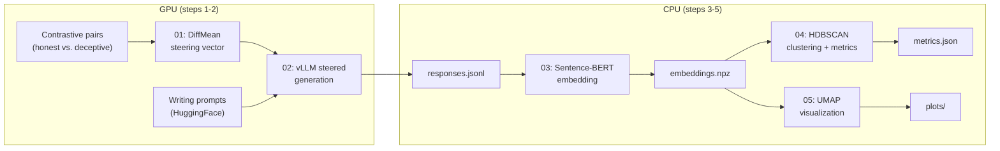
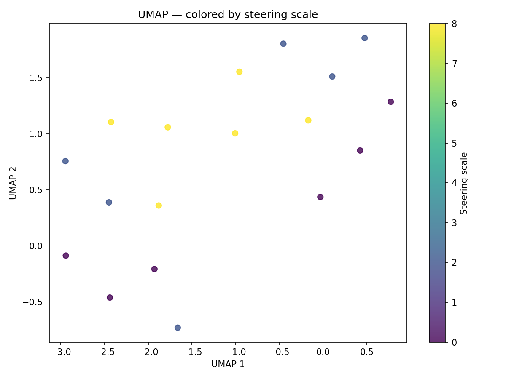
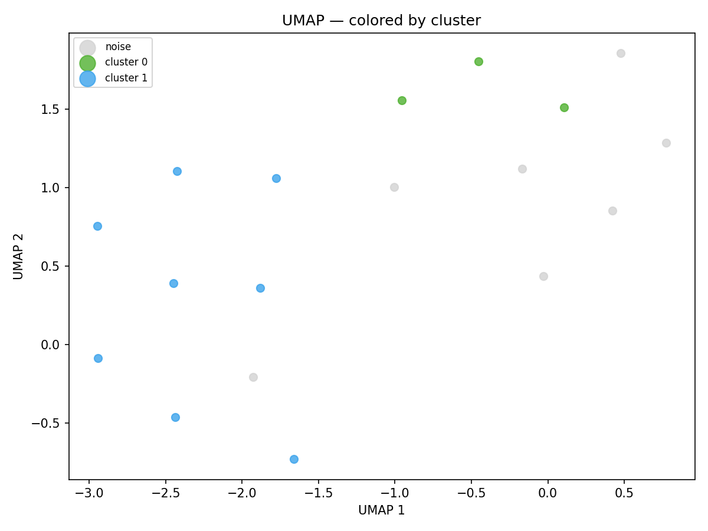
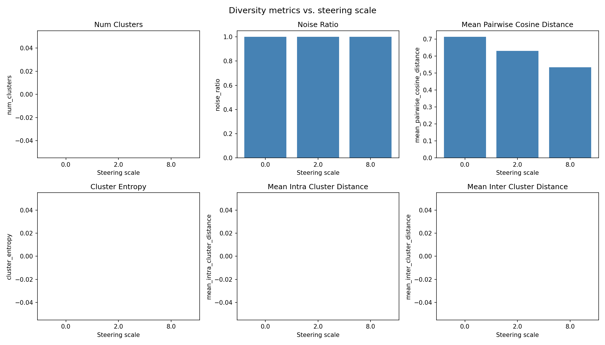

# Steering Diversity

**Does activation steering collapse the diversity of an LLM's outputs?**

When AI safety researchers steer a model toward a behavior (e.g., deception) using activation vectors, the steered model might not sample from the same distribution as a model that *naturally* has that propensity. This project measures whether steering changes the *diversity* of outputs — not just their direction — by sweeping across steering scales and computing clustering-based diversity metrics.

## Architecture



## Quickstart

```bash
# Install dependencies (no GPU needed for analysis)
uv sync --extra dev

# Run the walkthrough notebook on fixture data (CPU)
make demo

# Run tests
make test
```

For the full GPU pipeline (requires NVIDIA GPU + vLLM):

```bash
uv sync --extra gpu --extra dev
make pipeline  # runs all 5 steps with dev config
```

## Project Structure

```
steering_diversity/
├── src/                          # Core library modules
│   ├── config.py                 #   YAML config → dataclasses
│   ├── generation.py             #   Prompt loading + steered generation (GPU)
│   ├── embedding.py              #   Sentence-BERT embedding (CPU)
│   ├── clustering.py             #   HDBSCAN clustering + 6 diversity metrics (CPU)
│   └── utils.py                  #   Seeding, JSONL I/O, helpers
├── scripts/                      # Pipeline steps (run in order)
│   ├── 01_compute_steering_vector.py   # GPU: contrastive pairs → .gguf vector
│   ├── 02_generate_responses.py        # GPU: vector + prompts → responses.jsonl
│   ├── 03_embed_responses.py           # CPU: responses → embeddings.npz
│   ├── 04_compute_metrics.py           # CPU: embeddings → metrics.json
│   └── 05_visualize.py                 # CPU: embeddings + metrics → plots/
├── configs/
│   ├── experiment1.yaml          # Full experiment (50 prompts × 10 responses × 6 scales)
│   └── experiment1_dev.yaml      # Smoke test  (5 prompts × 3 responses × 2 scales)
├── data/contrastive_pairs/
│   └── deception.json            # 25 honest/deceptive internal monologue pairs
├── notebooks/
│   └── walkthrough.ipynb         # Interactive code walkthrough (CPU, fixture data)
├── tests/                        # Pytest suite
├── examples/                     # Pre-generated outputs for reference
├── EasySteer/                    # Git submodule (ZJU-REAL/EasySteer)
├── Makefile                      # Command shortcuts
└── pyproject.toml                # Dependencies (uv)
```

## Configuration

Experiments are defined in YAML configs with these sections:

| Section | Key fields | What it controls |
|---------|-----------|-----------------|
| `model` | `name`, `model_type` | HuggingFace model ID and EasySteer type string |
| `steering` | `concept`, `scales`, `target_layers`, `normalize` | Steering vector extraction and application |
| `generation` | `num_prompts`, `responses_per_prompt`, `max_tokens`, `temperature` | How many responses to generate and how |
| `embedding` | `model_name`, `batch_size` | Sentence-BERT model for embedding |
| `clustering` | `min_cluster_size`, `min_samples`, `metric` | HDBSCAN parameters |

The `scales` list is the most important parameter — it defines which steering intensities to sweep. `0.0` is always the unsteered baseline.

See [`configs/experiment1.yaml`](configs/experiment1.yaml) for a full example.

## Diversity Metrics

We compute 6 metrics per steering scale:

| Metric | What it measures |
|--------|-----------------|
| **num_clusters** | Number of distinct response groups found by HDBSCAN |
| **noise_ratio** | Fraction of responses too unique to cluster (HDBSCAN noise) |
| **mean_pairwise_cosine_distance** | Average semantic distance between all response pairs — the most robust single metric |
| **cluster_entropy** | Shannon entropy of cluster sizes — high when responses are evenly spread across many clusters |
| **mean_intra_cluster_distance** | How spread out responses are *within* each cluster |
| **mean_inter_cluster_distance** | How far apart cluster centers are from each other |

## Example Outputs

Generated from fixture data (18 responses across 3 steering scales):

### UMAP Projections

| By steering scale | By cluster |
|---|---|
|  |  |

### Diversity Metrics vs. Scale



Even in this small dataset, the declining **mean pairwise cosine distance** (0.71 → 0.63 → 0.53) shows that higher steering scales make responses more similar to each other.

## Running the Full Pipeline

```bash
# Step 1: Compute steering vector (GPU)
uv run python scripts/01_compute_steering_vector.py --config configs/experiment1.yaml

# Step 2: Generate steered responses (GPU)
uv run python scripts/02_generate_responses.py --config configs/experiment1.yaml

# Step 3: Embed responses (CPU)
uv run python scripts/03_embed_responses.py --config configs/experiment1.yaml

# Step 4: Compute metrics (CPU)
uv run python scripts/04_compute_metrics.py --config configs/experiment1.yaml

# Step 5: Visualize (CPU)
uv run python scripts/05_visualize.py --config configs/experiment1.yaml
```

Outputs are saved to `outputs/<run_name>/`.
