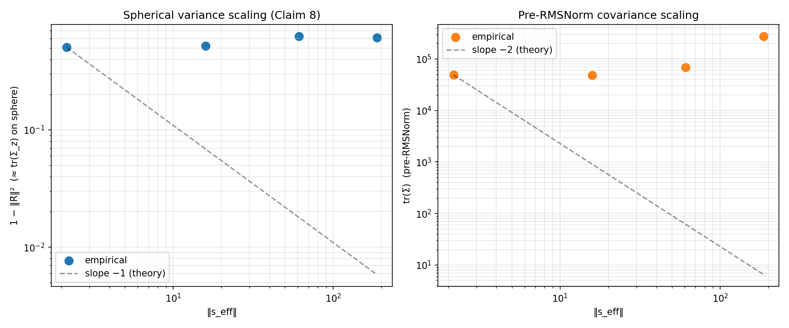
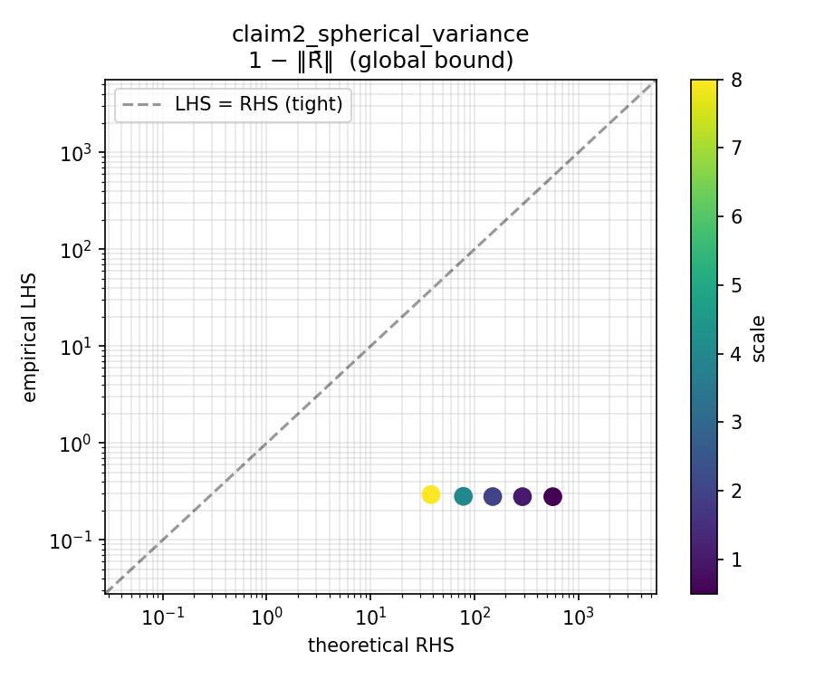

# Bounds-Verification Experiments

Empirical tests of the nine mathematical claims in
`docs/paper_sections/diversity_reduction_*.tex` about what activation
steering does to the distribution of residual-stream activations seen at
an RMSNorm site. Pipeline source lives under `src/bounds/` and
`scripts/bounds/`.

## Pipeline

Five scripts, CPU or GPU as noted. Outputs land in
`outputs/bounds/<run_name>/`.

| Script | Device | Input → Output |
|---|---|---|
| `scripts/bounds/01_verify_steering.py` | GPU | config → `verification/{scale_*.json, PASSED or FAILED}` sentinel |
| `scripts/bounds/02_record_stats.py` | GPU | config → `stats.pt` (per-scale Chan–Welford moments + reservoirs) + `stats_meta.json` |
| `scripts/bounds/03_compute.py` | CPU | `stats.pt` → `bounds_metrics.json` |
| `scripts/bounds/04_visualize.py` | CPU | `bounds_metrics.json` + `stats.pt` → `plots/*.{png,md}` |

`02_record_stats.py` refuses to run without a `verification/PASSED` sentinel
from step 01 — this is the "trust no silent steering" gate (see
`feedback_verify_steering_by_sampling.md`).

Each plot gets a sidecar markdown caption (`*.md`) next to its PNG
containing the interpretation and the observed numerical values for that
specific run, so every figure travels with a self-contained explanation.

## Key finding: bounds hold, but are loose at project scales

Across all three completed Qwen runs at the project's operating scales
`[0, 0.5, 1, 2, 4, 8]`, and an extended probe at `[0, 1, 8, 32, 128]`:

- **Exact global bounds (Claims 3, 5) hold everywhere.** These are pure
  inequalities, and they're satisfied at every scale on every vector.
- **The predicted `1/‖s‖` and `1/‖s‖²` scaling laws (Claim 8) do NOT
  manifest.** Measured log-log slopes of spherical variance vs ‖s_eff‖
  are near zero (−0.003 to +0.016) instead of the theoretical −1, even
  in the extended-scale probe up to scale 128.
- **Reason:** natural Qwen2.5-1.5B residual stream norms are ~300–500
  while the achievable `‖s_eff‖` before the model outputs pure gibberish
  is ~15 (project scales) to ~187 (scale 128). The asymptotic
  concentration-on-pole regime where the 1/‖s‖ law would kick in
  requires `‖s_eff‖ ≫ E[‖x‖]`, which is unreachable in practice.

See [`project_bounds_hold_but_loose.md`](../../.claude/projects/-home-cs29824-matthew-steering-diversity/memory/project_bounds_hold_but_loose.md)
(local memory file) for the full diagnostic.

## Runs

All runs use `HuggingFaceFW/fineweb-edu` (1000 prompts, 256 max tokens
per prompt) except the extended-scale probe which uses 100 prompts. All
use `capture_specs: [{site: final, tier: full}]` on the final RMSNorm
site. Reservoir K = 1024.

### Qwen2.5-1.5B-Instruct

| Run | Steering vector | Target layers | Scale sweep |
|---|---|---|---|
| [`bounds_qwen_happy`](../../outputs/bounds/bounds_qwen_happy/plots/) | `EasySteer/vectors/happy_diffmean.gguf` | 10–25 | 0, 0.5, 1, 2, 4, 8 |
| [`bounds_qwen_style`](../../outputs/bounds/bounds_qwen_style/plots/) | `EasySteer/replications/steerable_chatbot/style-probe.gguf` | 0–27 | 0, 0.5, 1, 2, 4, 8 |
| [`bounds_qwen_random`](../../outputs/bounds/bounds_qwen_random/plots/) | Norm-matched random (seed=0, matched to `happy_diffmean`) | 10–25 | 0, 0.5, 1, 2, 4, 8 |
| [`bounds_qwen_happy_extended`](../../outputs/bounds/bounds_qwen_happy_extended/plots/) | `happy_diffmean.gguf` | 10–25 | 0, 1, 8, 32, 128 (diagnostic probe) |

### Meta-Llama-3-8B-Instruct

| Run | Steering vector | Target layers | Scale sweep | Status |
|---|---|---|---|---|
| [`bounds_llama_creativity`](../../outputs/bounds/bounds_llama_creativity/plots/) | `EasySteer/replications/creative_writing/create.gguf` | 16–29 | 0, 0.5, 1, 2, 4, 8 | (running as of this commit) |
| [`bounds_llama_random`](../../outputs/bounds/bounds_llama_random/plots/) | Norm-matched random (seed=0) | 16–29 | 0, 0.5, 1, 2, 4, 8 | (queued) |

## Headline figures

### Scaling law (the most important plot)

Both panels show observed empirical slopes near zero vs theoretical slopes
of −1 (spherical variance) and −2 (`tr(Σ_x)`). The gap between empirical
and theoretical is visually unmistakable.

**Project scales `[0.5..8]` (`bounds_qwen_happy`):**


*Caption: [`scaling_law.md`](../../outputs/bounds/bounds_qwen_happy/plots/scaling_law.md)*

**Extended probe `[1, 8, 32, 128]` (`bounds_qwen_happy_extended`):**



*Caption: [`scaling_law.md`](../../outputs/bounds/bounds_qwen_happy_extended/plots/scaling_law.md)*

Even at scale 128 (yellow points), spherical variance sits at ~0.38
instead of the ~0.015 the theoretical slope predicts. The pre-RMSNorm
`tr(Σ_x)` actually *grows* at large scales (steering injects variance)
instead of shrinking as `1/‖s‖²` would require.

### Claim 2 — spherical variance bound

Cluster of points well below the diagonal → bound holds. Gap to the
diagonal → how loose. All five Qwen-happy points sit 2–3 orders of
magnitude below the diagonal; the bound is everywhere satisfied but
nowhere tight.



*Caption: [`claim2_spherical_variance_lhs_vs_rhs.md`](../../outputs/bounds/bounds_qwen_happy/plots/claim2_spherical_variance_lhs_vs_rhs.md)*

### Claim 7 behaviour differs by vector

The reduction condition `‖μ+s‖ > ‖μ‖` gates whether steering shrinks or
magnifies variance:

- `bounds_qwen_happy`: ❌ at every scale (happy vector moves `‖μ‖` *down*)
- `bounds_qwen_style`: ✅ at every scale
- `bounds_qwen_random`: ✅ at every scale

This was not predicted in advance. It means the paper's diversity-reduction
story applies to the style and random vectors on Qwen in this regime, but
not the happy vector — which happens to push in a ‖μ‖-decreasing direction.

## How to reproduce a run

```bash
# 1. Verify the steering lands. First GPU step — stop and reserve the GPU.
uv run python scripts/bounds/01_verify_steering.py \
    --config configs/bounds/qwen_happy.yaml \
    --auto-escalate

# 2. Record 1000-prompt streaming stats. ~8 min on a Quadro RTX 8000.
uv run python scripts/bounds/02_record_stats.py \
    --config configs/bounds/qwen_happy.yaml

# 3. Compute bounds (CPU, pure post-processing, seconds).
uv run python scripts/bounds/03_compute.py \
    --stats outputs/bounds/bounds_qwen_happy/stats.pt \
    --config configs/bounds/qwen_happy.yaml

# 4. Render plots + captions.
uv run python scripts/bounds/04_visualize.py \
    --metrics outputs/bounds/bounds_qwen_happy/bounds_metrics.json
```

For the CPU smoke test (no GPU, no real steering vector, ~seconds):

```bash
uv run python scripts/bounds/01_verify_steering.py --config configs/bounds/smoke.yaml
uv run python scripts/bounds/02_record_stats.py --config configs/bounds/smoke.yaml
uv run python scripts/bounds/03_compute.py --stats outputs/bounds/bounds_smoke/stats.pt
uv run python scripts/bounds/04_visualize.py --metrics outputs/bounds/bounds_smoke/bounds_metrics.json
```

## Implementation notes

- **Streaming stats** use Chan–Golub–LeVeque batched Welford merges in
  `src/bounds/activation_streams.py`. The big-mean / small-batch regime
  specific to residual streams makes the `welford-torch` library diverge
  by >100% in float32 — see
  [`docs/upstream_bug_reports/welford_torch_big_mean_drift/`](../../docs/upstream_bug_reports/welford_torch_big_mean_drift/)
  for the reproducer and upstream issue writeup.
- **Cross-checks** against numpy authoritative references live at
  `tests/bounds/test_activation_streams_crosscheck.py` (29 test cases).
- **Intervention sharing:** `src/bounds/nnsight_runner.py` exposes
  `run_bounds_forward_pass`, `run_verification_forward_pass`, and
  `sample_from_steered_model` which all call the same
  `_add_steering_at_layers` helper. This guarantees that verification
  samples use the identical intervention as the recording runs.
- **Stored data per run:** `stats.pt` contains the per-scale finalized
  `CheapMoments`/`FullMoments`/`SphericalMoments` outputs plus a reservoir
  sample — typically ~50-250 MB per run depending on `d` and `K`.
  Reservoirs allow post-hoc pairwise checks (Claims 4, 5) without storing
  raw activations.

## Related

- Plan: `/home/cs29824/.claude/plans/memoized-dazzling-phoenix.md`
  (local to the machine this was developed on)
- Memory: `project_bounds_hold_but_loose.md` — key scientific finding
- Memory: `project_welford_torch_big_mean_drift.md` — upstream library bug
- Memory: `feedback_verify_steering_by_sampling.md` — verification policy
