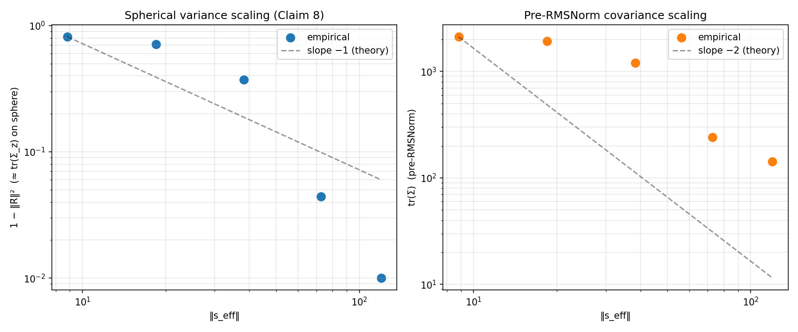
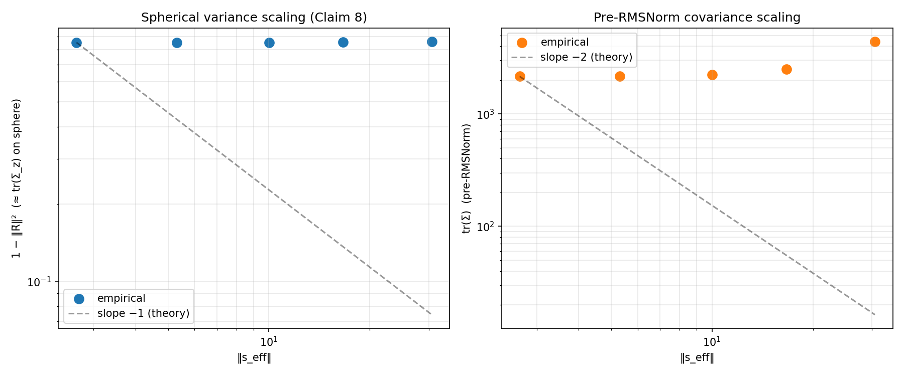
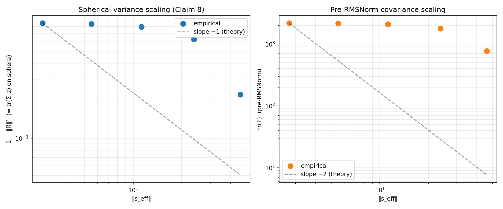
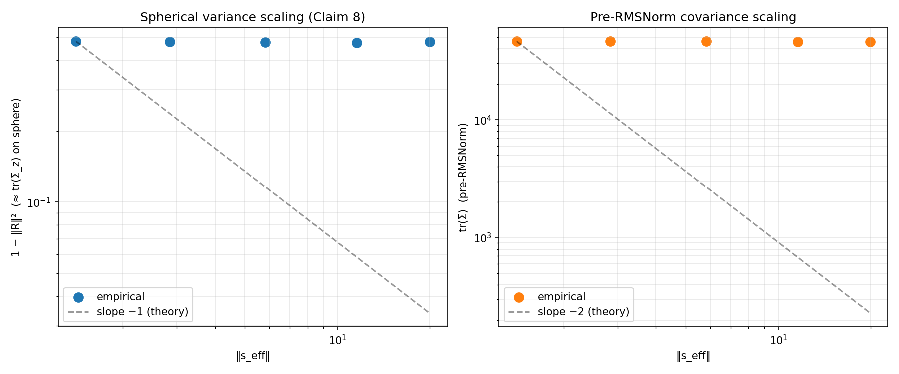
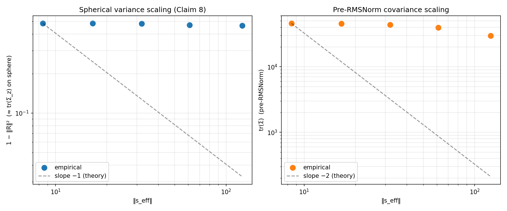
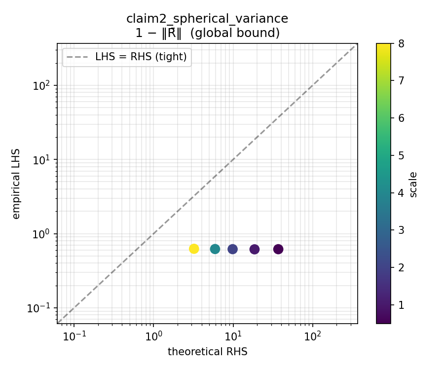

# Bounds-Verification Experiments

Empirical tests of the nine mathematical claims in
`docs/paper_sections/diversity_reduction_*.tex` about what activation
steering does to the distribution of residual-stream activations seen at
an RMSNorm site. Pipeline source lives under `src/bounds/` and
`scripts/bounds/`.

## Pipeline

| Script | Device | Input → Output |
|---|---|---|
| `scripts/bounds/01_verify_steering.py` | GPU | config → `verification/{scale_*.json, PASSED or FAILED}` sentinel |
| `scripts/bounds/02_record_stats.py` | GPU | config → `stats.pt` + `stats_meta.json` |
| `scripts/bounds/03_compute.py` | CPU | `stats.pt` → `bounds_metrics.json` |
| `scripts/bounds/04_visualize.py` | CPU | `bounds_metrics.json` + `stats.pt` → `plots/*.{png,md}` |

`02_record_stats.py` refuses to run without a `verification/PASSED`
sentinel from step 01.

Each plot gets a sidecar markdown caption (`*.md`) next to its PNG
containing the interpretation and the observed numerical values for that
specific run.

## Key finding: bounds hold; scaling law is architecture- and vector-dependent

Across all 5 runs at the project's operating scales `[0, 0.5, 1, 2, 4, 8]`:

- **Exact global bounds (Claims 3, 5) hold at every scale on every vector.** These are strict inequalities on the unit sphere and they're satisfied cleanly.
- **Claim 8's predicted −1/−2 scaling slopes manifest on Llama but not Qwen.**
  | Run | slope `V = 1−‖R̄‖²` | slope `tr(Σ)` pre-norm |
  |---|---|---|
  | `bounds_qwen_happy` | −0.018 | −0.015 |
  | `bounds_qwen_style` | **−0.285** | −0.254 |
  | `bounds_qwen_random` | −0.035 | −0.029 |
  | **`bounds_llama_creativity`** | **−1.921** | **−1.773** |
  | `bounds_llama_random` | **−0.514** | −0.410 |
  
  Theoretical prediction: `slope_V = −1`, `slope_trZ = −2`. On Llama‑3‑8B with the creativity vector, empirical `slope_V` actually *exceeds* the theoretical magnitude (−1.92 vs −1) — the steering is strong enough at scales 4, 8 to push the residual distribution into super-linear collapse. On Qwen2.5‑1.5B the slopes are much shallower (−0.02 to −0.29) because the achievable `‖s_eff‖` never reaches the asymptotic regime.

- **Claim 7 (reduction condition `‖μ+s‖ > ‖μ‖`) fails for `qwen_happy` at every scale.** Root cause confirmed by token‑level projection: the `happy_diffmean.gguf` vector was trained on happy‑vs‑sad role-play prompts ("Act as if you're extremely happy/sad"), and FineWeb-Edu's residual mean `μ` is mildly anti-aligned with it (`cos(μ, Σ layer happy) = −0.108`, ~4σ from random; see [`scripts/bounds/investigations/03_investigate_happy_data_alignment.py`](../../scripts/bounds/investigations/03_investigate_happy_data_alignment.py) for the re-runnable probe). Adding the happy direction deflects `μ` sideways rather than elongating it, so `‖μ + s_eff‖ < ‖μ‖` at small scales. The other four configs (`qwen_style`, `qwen_random`, `llama_creativity`, `llama_random`) pass Claim 7 everywhere.

## Experiment 2: aggregate-matched random + single-layer sweep

After Experiment 1's "scaling law manifests on Llama but not Qwen" finding,
two controls were added to disentangle competing explanations:

1. **Aggregate-matched random (2 runs)** — drop the per-layer L2 matching
   and instead rescale random vectors uniformly so ``‖Σ r_i‖`` equals
   ``‖Σ h_i‖`` over the target layers. The original per-layer match
   produced aggregate random ``~√n`` smaller than real (because random
   directions don't stack coherently), confounding "direction matters"
   with "aggregate magnitude matters."
2. **Single-layer sweep (12 runs)** — intervene at a single layer per
   prompt, picked edge/middle/edge of the target range (Qwen happy at
   L10/L17/L25, Llama creativity at L16/L22/L29), with a matched random
   control at each picked layer.

### Key result: aggregate magnitude dominates semantic direction for Claim 8

| Run | slope V | slope tr(Σ) |
|---|---:|---:|
| `bounds_llama_creativity` (real, from Experiment 1) | **−1.921** | −1.773 |
| [`bounds_llama_random_agg_matched`](../../outputs/bounds/bounds_llama_random_agg_matched/plots/) | **−1.851** | −1.710 |
| `bounds_llama_random` (per-layer matched, Experiment 1) | −0.514 | −0.410 |

At matched aggregate ``‖Σ s_i‖``, a **random** steering direction drives
Llama's spherical-variance scaling almost as hard as the trained creativity
direction does (−1.85 vs −1.92). The Experiment 1 "random has a shallow
slope" finding was almost entirely explained by the ~3× aggregate-norm gap
between per-layer-matched random and the real vector. With that gap closed,
**the Claim-8 scaling law isn't really about semantic direction, it's
about aggregate magnitude in the asymptotic regime**.

Qwen shows the same *pattern* in miniature: `bounds_qwen_random_agg_matched`
has slope_V = **−0.196**, clearly negative and ~5× more asymptotic than
per-layer-matched random (−0.035). It's still far from the theoretical
−1 because Qwen2.5-1.5B's residual stream norms are so large that even
the aggregate-matched magnitude can't push into the asymptotic regime.



### Single-layer: the intervention mostly doesn't bite

Single-layer slopes are near zero on both models — the effective
``‖s_eff‖`` from a one-layer intervention is too small to reach asymptotic
behavior. The detailed numbers:

| Run | slope V | slope tr(Σ) | Claim 7 |
|---|---:|---:|:---:|
| `bounds_qwen_happy_single_L10` | −0.004 | −0.004 | all pass |
| `bounds_qwen_happy_single_L17` | +0.005 | +0.004 | **all fail** |
| `bounds_qwen_happy_single_L25` | +0.003 | +0.002 | **all fail** |
| `bounds_qwen_random_single_L10` | −0.004 | −0.003 | all pass |
| `bounds_qwen_random_single_L17` | +0.003 | +0.002 | **all fail** |
| `bounds_qwen_random_single_L25` | +0.000 | +0.000 | mixed |
| `bounds_llama_creativity_single_L16` | −0.060 | −0.036 | mixed |
| `bounds_llama_creativity_single_L22` | −0.055 | −0.033 | all pass |
| `bounds_llama_creativity_single_L29` | −0.029 | −0.017 | all pass |
| `bounds_llama_random_single_L16` | −0.039 | −0.023 | all pass |
| `bounds_llama_random_single_L22` | −0.043 | −0.026 | all pass |
| `bounds_llama_random_single_L29` | −0.031 | −0.018 | all pass |

### New finding: single-layer Claim 7 failures at late layers on Qwen, even for random

`qwen_happy_single_L17` and `_L25` fail Claim 7 at every scale — but so do
the **random** versions at the same layers (`qwen_random_single_L17` fully
fails, `_L25` is mixed). This is NOT the "happy is anti-aligned with μ"
story from Experiment 1 (that failure was specific to the happy direction).
It's a position-dependent effect that affects any direction.

Probable mechanism: single-layer steering at L10 has 15 more decoder
blocks downstream to amplify the intervention via the variance-growth
effect. By the final-site measurement, ``‖s_eff‖`` is large enough that
``‖s‖²`` dominates ``2μ·s`` and Claim 7 passes. Late single-layer
steering at L25 doesn't have time to amplify (only layers 26, 27 left),
so ``‖s_eff‖`` stays small and the sign of ``μ·s`` matters — which
fluctuates near zero for both directions and tips negative more often
than not.

The Experiment 2 orchestration script + configs are at
[`scripts/bounds/experiment2/`](../../scripts/bounds/experiment2/) and
[`configs/bounds/experiment2/`](../../configs/bounds/experiment2/). Full
per-run details live in
[`outputs/bounds/experiment2/summary.md`](../../outputs/bounds/experiment2/summary.md).

## Historical note

Results were re-run end-to-end after a batch‑indexing bug in
`_add_steering_at_layers` was discovered: on Qwen2/Llama3 under HF
transformers ≥ 4.40, `layer.output` is the `[B, T, d]` hidden-state
tensor directly (not a 1-tuple), so `.output[0]` was silently selecting
batch element 0 and only steering the first prompt per batch. Tiny-gpt2
CPU tests passed because GPT-2 uses the tuple convention.

Fix: `_is_tuple_output_architecture()` dispatcher branches the
intervention path on architecture, and shape assertions at every
capture site catch similar bugs instantly. Regression test
`test_steering_affects_every_batch_element` in
`tests/bounds/test_nnsight_runner.py` pins the multi-batch invariant.
All previous results have been moved to
`discarded/corrupted_bounds_batch_bug/` per the project's never-delete
policy.

## Runs

All runs: `HuggingFaceFW/fineweb-edu`, 1000 prompts, 256 max tokens,
`capture_specs: [{site: final, tier: full}]`, reservoir K = 1024.

### Qwen2.5-1.5B-Instruct

| Run | Steering vector | Target layers | Scale sweep |
|---|---|---|---|
| [`bounds_qwen_happy`](../../outputs/bounds/bounds_qwen_happy/plots/) | `EasySteer/vectors/happy_diffmean.gguf` | 10–25 | 0, 0.5, 1, 2, 4, 8 |
| [`bounds_qwen_style`](../../outputs/bounds/bounds_qwen_style/plots/) | `EasySteer/replications/steerable_chatbot/style-probe.gguf` | 0–27 | 0, 0.5, 1, 2, 4, 8 |
| [`bounds_qwen_random`](../../outputs/bounds/bounds_qwen_random/plots/) | Norm-matched random (seed=0, matched to `happy_diffmean`) | 10–25 | 0, 0.5, 1, 2, 4, 8 |

### Meta-Llama-3-8B-Instruct

| Run | Steering vector | Target layers | Scale sweep |
|---|---|---|---|
| [`bounds_llama_creativity`](../../outputs/bounds/bounds_llama_creativity/plots/) | `EasySteer/replications/creative_writing/create.gguf` | 16–29 | 0, 0.5, 1, 2, 4, 8 |
| [`bounds_llama_random`](../../outputs/bounds/bounds_llama_random/plots/) | Norm-matched random (seed=0, matched to `create.gguf`) | 16–29 | 0, 0.5, 1, 2, 4, 8 |

## Headline figures

### Scaling law plots

On **Llama‑3‑8B**, the predicted slope manifests cleanly — empirical
points actually overshoot the theoretical slope reference for
creativity at large scales.



*Caption: [`scaling_law.md`](../../outputs/bounds/bounds_llama_creativity/plots/scaling_law.md)*



*Caption: [`scaling_law.md`](../../outputs/bounds/bounds_llama_random/plots/scaling_law.md)*

On **Qwen2.5‑1.5B**, the slopes are shallow. Style shows the clearest
partial‑asymptotic behavior (slope ≈ −0.29); happy and random are
nearly flat.



*Caption: [`scaling_law.md`](../../outputs/bounds/bounds_qwen_style/plots/scaling_law.md)*



*Caption: [`scaling_law.md`](../../outputs/bounds/bounds_qwen_happy/plots/scaling_law.md)*

### Claim 2 — spherical variance bound LHS vs RHS



*Caption: [`claim2_spherical_variance_lhs_vs_rhs.md`](../../outputs/bounds/bounds_llama_creativity/plots/claim2_spherical_variance_lhs_vs_rhs.md)*

## How to reproduce a run

```bash
# 1. Verify steering lands (all batch elements must be affected).
uv run python scripts/bounds/01_verify_steering.py \
    --config configs/bounds/qwen_happy.yaml --auto-escalate

# 2. Record 1000-prompt streaming stats. ~8 min on RTX 8000 for Qwen, ~25 min for Llama.
uv run python scripts/bounds/02_record_stats.py \
    --config configs/bounds/qwen_happy.yaml

# 3. Compute bounds (CPU, pure post-processing, seconds).
uv run python scripts/bounds/03_compute.py \
    --stats outputs/bounds/bounds_qwen_happy/stats.pt \
    --config configs/bounds/qwen_happy.yaml

# 4. Render plots + captions.
uv run python scripts/bounds/04_visualize.py \
    --metrics outputs/bounds/bounds_qwen_happy/bounds_metrics.json
```

## Implementation notes

- **Streaming stats** use Chan–Golub–LeVeque batched Welford merges in
  `src/bounds/activation_streams.py`. See
  [`docs/upstream_bug_reports/welford_torch_big_mean_drift/`](../upstream_bug_reports/welford_torch_big_mean_drift/)
  for a related upstream numerical-stability issue we found and reported.
- **Cross-checks** against numpy live at
  `tests/bounds/test_activation_streams_crosscheck.py` (29 test cases).
- **Intervention sharing:** `run_bounds_forward_pass`,
  `run_verification_forward_pass`, and `sample_from_steered_model` all
  call the same `_add_steering_at_layers` helper which dispatches on
  `_is_tuple_output_architecture(lm)`.
- **Shape assertions** at every capture-materialization point catch
  silent dimension bugs (see `feedback_assert_tensor_shapes.md` memory).

## How we got here: investigation trail

The production code in `src/bounds/` and `scripts/bounds/` is cleaner
than the path that built it. Four probes and data-diagnostic scripts
under [`scripts/bounds/investigations/`](../../scripts/bounds/investigations/)
preserve the questions, methods, and findings — each maps to a specific
piece of production code or a number quoted above:

- **[`01_probe_nnsight_api.py`](../../scripts/bounds/investigations/01_probe_nnsight_api.py)** — probed nnsight 0.6's decoder-layer `.input`/`.output`/`.save()` API on tiny-gpt2. Established the `.output[0]` tuple-unpack pattern (correct on GPT-2) that, unfortunately, also silently selected batch element 0 on Qwen2/Llama3 and contaminated the first 5 full runs. Drove `_is_tuple_output_architecture` + shape assertions.
- **[`02_probe_nnsight_generate.py`](../../scripts/bounds/investigations/02_probe_nnsight_generate.py)** — confirmed that `lm.generate() + with tracer.all(): ...` is the correct pattern to apply a steering intervention on every decode step. Drove `sample_from_steered_model`.
- **[`03_investigate_happy_data_alignment.py`](../../scripts/bounds/investigations/03_investigate_happy_data_alignment.py)** — computed `cos(μ_unsteered, Σ happy) = −0.108` on FineWeb-Edu + Qwen, and the token-level `lm_head` projection showing the data is tone-neutral (not "sad"). Explains the Claim 7 failure quoted above.
- **[`04_compare_real_vs_random_norms.py`](../../scripts/bounds/investigations/04_compare_real_vs_random_norms.py)** — measured the ~3× gap between real and random aggregate norms (coherent vs `√n` stacking). Drove `generate_random_steering_vector_aggregate_matched` and the aggregate-matched random control in Experiment 2.

Detail lives in [`scripts/bounds/investigations/README.md`](../../scripts/bounds/investigations/README.md).
