# How Well Does Steering Demonstrate a Model's True Diversity?

Matthew Khoriaty, David Williams-King, Shi Feng

---

## Abstract

Activation steering has become an important tool in AI safety research for eliciting targeted model behaviors. In particular, one use case of steering is to make AIs "think they are deployed" so we can evaluate them without their awareness of being evaluated influencing their behaviors. However, the effect of steering on the _diversity_ of model outputs remains unstudied. If steering collapses a model's output distribution, then steered model organisms may fail to represent the full range of behaviors the model is capable of, and safety evaluations built on steering may miss concerning behaviors the model would actually exhibit in deployment.

I investigate this question across three steering concepts (happy, style, creativity), two model architectures (Qwen2.5-1.5B, Llama-3-8B), and multiple diversity metrics (Sentence-BERT cosine distance, HDBSCAN clustering, n-gram diversity). Steering does reduce measurable diversity (by 19%–50% depending on concept), though the effect varies substantially across steering vectors and models. There is more work to be done in validating that these measurements capture meaningful diversity — current metrics may miss important dimensions of behavioral variation.

I additionally conduct a baseline survey of evaluation awareness across 13 frontier models and design a steering experiment to test whether Microsoft's test-awareness probes can reduce eval detection in Qwen3-32B.

<!-- TODO: Update abstract once eval awareness steering results and additional experiments are complete -->

---

## 1. Introduction

### 1.1 Motivation

Researchers studying AI safety often want to answer the counterfactual question: "What would happen if this model decided to exhibit a certain behavior of interest?" Because models often lack the _propensity_ toward concerning behaviors even when they possess the _capability_, researchers use various elicitation methods — prompting, fine-tuning, and activation steering — to surface these latent capabilities.

Activation steering has gained significant traction as a research tool because of its flexibility: given contrastive examples, one can extract a steering vector targeting nearly any behavioral property and apply it at inference time without retraining. This has led to a common pattern in safety research where statements like "we steer the model on X" are used for abstract, hard-to-define concepts like deceptive intent, evaluation awareness, or sycophancy. One concrete and important use case is steering models to "think they are deployed" so that safety evaluations are not influenced by the model's awareness of being evaluated (Hua et al., 2025).

However, if steering methods collapse the diversity of model outputs — producing model organisms that are deceptive in only one way, or respond to "deployment" with only one template response — then steered models may be poor proxies for what a model would actually do in deployment. Safety evaluations built on steering may miss concerning behaviors the model is capable of. This would undermine a growing body of safety research that relies on steering to construct model organisms for study.

### 1.2 Theory of Change

- **Models may hide their abilities from auditors.** Unlocking their abilities in controlled settings allows developers to be more cautious with deployment. If steering models to act like they are deployed does not allow us to sample from the full diversity of "deployed models," then this steering approach will not be as effective as hoped.
- **Future models may acquire capabilities and goals together "in-the-wild"** through learning from experience. There would be no "helpful-only" model on which to evaluate capabilities in isolation, making better methods to uncover capabilities vital.
- **Force multiplier for model organisms research.** If we can characterize how different elicitation methods affect output diversity, we can provide recommendations for how to produce more representative model organisms.
- **Critique of a common narrative.** If steering methods differ in the range of outputs they evoke and "miss" outputs the model is capable of producing, that demonstrates a problem with uncritical reliance on steering in safety research.

<!-- NOTE: Shi is interested in the "appears in one approach but not another" angle as a way to study strategies the model could use. See "Striking Examples" in Section 6. -->

### 1.3 Key Assumptions

1. **Propensity vs. Capability.** Propensity is likely a thin layer on top of the bulk of model parameters used for capabilities. This assumption is supported by parameter-efficient fine-tuning working for alignment and steering vectors working to influence behavior. For steering vectors to be useful for evals, they must change the model's 'beliefs' and propensities without damaging capabilities. We consider diversity of output to be a capability.

2. **Diversity as a proxy for worst-case behavior.** We assume that measuring the diversity of steered outputs is a valid proxy for assessing whether steering captures the full range of concerning behaviors. This is tractable and generally informative than trying to maximize a narrow instance, though more sophisticated quality-diversity algorithms might have advantages in finding interesting behaviors.

### 1.4 Contributions

- I measure steering's effect on output diversity across **two model architectures and three steering concepts**, finding diversity reductions of 19%–50% depending on the concept and model. The effect varies substantially, and current metrics may not fully capture meaningful diversity — more validation is needed.
- I conduct a **baseline survey of evaluation awareness** across 13 frontier models, identifying which models detect evaluations and which are suitable targets for steering experiments.
- I design and pre-register a **steering experiment** testing whether test-awareness probes can reduce eval detection, with explicit hypotheses (H1–H4) committed before data collection.
- I develop an **in-context learning diversity metric** (separate paper) that provides a coherence-weighted, model-based measure of response diversity. This metric requires further validation on real experimental data.
- I plan **pass@k experiments** for steered models — a universally respected performance measure that is closely connected to diversity, requiring a measure of success and a problem set rather than just comparing response sets.

---

## 2. Related Work

### Steering Methods and Mechanisms

- Turner et al. (2024). [Contrastive Activation Addition](https://aclanthology.org/2024.acl-long.828/). The foundational CAA method for activation steering.
- Yang et al. (2025). [Why Steering Works: Toward a Unified View of Language Model Parameter Dynamics](https://arxiv.org/abs/2602.02343). Theoretical framework for understanding steering.
- Tan et al. (2025). [The Truthfulness Spectrum Hypothesis](https://arxiv.org/abs/2602.20273). Domain-specific steering works better than general steering; good general vectors can be constructed by aggregation of specific ones.
  <!-- NOTE: https://x.com/KhoriatyMatthew/status/2028845378821337567 -->
- Chanin et al. (2024). [Analyzing the Generalization and Reliability of Steering Vectors](https://arxiv.org/abs/2407.12404). Studies when steering vectors generalize.
- https://github.com/mll-lab-nu/RAGEN/blob/main/RAGEN-v2.pdf
- - Mutual information instead of entropy as meaningful metric
- https://aclanthology.org/2024.findings-acl.199.pdf
  - They are research how to make it so that slight changes in prompts should lead to the same outputs.
  - Mean pairwise cosine (like we already were doing). Also accuracy-as-consistency and asking GPT4 whether two responses are the same. Not very relevant to my work. https://claude.ai/share/4b520455-9d86-4fb0-912e-9760af82a473
- https://arxiv.org/pdf/2406.00244
  - They identify an "uncertainty" vector and use it to steer the AI to explore more. Not directly relevant, since we are interested in the range of sampled behaviors.
- https://openreview.net/pdf?id=2U1KIfmaU9
  - Overview of Representation Engineering, by someone who has given me advice on the paper (Jan Wehner).
  <!--> The third theoretical pillar is Riechers, Bigelow, Alt, and Shai's "Next-token pretraining implies in-context learning" (2025), which provides an information-theoretic framework arXiv showing that arXivarXiv cross-entropy loss reduction across context positions converges to E=I[X←;X→]E = I[\overleftarrow{X}; \overrightarrow{X}]

<!--E=I[X;X], the
mutual information between past and future — which is exactly the excess entropy of Crutchfield and Feldman. This paper mathematically validates the proposed metric's core claim: the total area under the surprise curve (above the asymptotic floor) measures mutual information, and its shape reveals the statistical structure of the data-generating process. arXiv
https://arxiv.org/abs/2505.18373 -->

### Diversity Metrics for Language Models

- Kirk et al. (2023). [Understanding the Effects of RLHF on LLM Generalisation and Diversity](https://arxiv.org/abs/2310.06452). The primary reference for our n-gram and SentBERT diversity metrics. We use their codebase (`rlfh-gen-div/`).
- Tevet & Berant (2021). [Evaluating the Evaluation of Diversity in Natural Language Generation](https://aclanthology.org/2021.eacl-main.25/). Kirk et al.'s source for diversity evaluation methodology.

### Evaluation Awareness

- Perez et al. (2026). [Large Language Models Often Know When They Are Being Evaluated](https://github.com/jjpn97/eval_awareness). The eval awareness pipeline we use for our baseline survey.
- Hua et al. (2025). [Steering Evaluation-Aware Models to Act Like They Are Deployed](https://arxiv.org/abs/2510.20487). Demonstrates steering eval-aware models toward deployment behavior. Key motivation for our diversity question.
- Vellat et al. (2025). [The Hawthorne Effect in Reasoning Models: Evaluating and Steering Test Awareness](https://arxiv.org/abs/2505.14617). Microsoft's test-awareness probing framework; we use their pre-trained Qwen3-32B probes.

### Model Organisms and Safety Evaluation

- Shevlane et al. (2023). [Latent Adversarial Training Improves Robustness to Persistent Harmful Behaviors in LLMs](https://arxiv.org/abs/2407.15549). Adversarial training on latent perturbations.
- Greenblatt et al. (2024). [Thinking about propensity evaluations](https://forum.effectivealtruism.org/posts/rAL3YAYYr6gGcyzq5/thinking-about-propensity-evaluations). Framework for thinking about propensity vs. capability.
- Nanda et al. (2025). [Thought Branches](https://arxiv.org/abs/2510.27484). Analysis of branching reasoning in LLMs.
- Liars' Bench (2025). [Evaluating Lie Detectors for Language Models](https://arxiv.org/abs/2511.16035).

### Quality-Diversity and Clustering

- Shi sent: [Bloom (Anthropic)](https://www.anthropic.com/research/bloom) — quality-diversity algorithms for finding interesting behaviors.
- [Quality-diversity in safety contexts](https://arxiv.org/abs/2504.09389) — combining quality-diversity framing with safety relevance.
- [Transluce/Docent](https://arxiv.org/abs/2602.10371) — reviewing agent transcripts.
  <!-- NOTE: Claude chat on clustering approaches: https://claude.ai/share/afa9ccc4-bf48-4256-b215-0640539a365d -->
  <!-- NOTE: Claude chat on this project 2026-02-18: https://claude.ai/share/27d028f0-5a79-4119-917a-5efaea31edd7 -->

---

## 3. Methods

### 3.1 Steering Infrastructure

We use [EasySteer](https://github.com/ZJU-REAL/EasySteer) (forked to [AMindToThink/EasySteer](https://github.com/AMindToThink/EasySteer)) for steering vector extraction and application. EasySteer supports multiple extraction algorithms (DiffMean, PCA, LAT, LinearProbe, SAE) and runtime steering algorithms; we plan to use additional methods from EasySteer and other libraries in future experiments.

All three steering vectors used in our current experiments are **precomputed defaults** shipped with EasySteer. At inference time, all use the same mechanism: the steering vector is **directly added to the model's residual stream** at specified layers with a configurable scale factor (`residual_stream += scale * vector`). Higher scales produce stronger behavioral effects but may degrade coherence at extreme values.

#### 3.1.1 Happy Vector (Emotion)

A precomputed **DiffMean** vector (`EasySteer/vectors/happy_diffmean.gguf`) from EasySteer's default emotion extraction. The vector is the difference of mean hidden states between positive (happy/ecstatic/delighted/glad) and negative (sad/depressed/dismayed/miserable) contrastive prompts of the form "Act as if you're extremely [emotion]." Extracted from the last token position across **layers 10–25** of Qwen2.5-1.5B-Instruct. **Normalized** after extraction.

<!-- NOTE on normalization (two distinct settings in EasySteer):
  1. EXTRACTION-TIME normalization (used here, `normalize: true` in config): Each layer's
     DiffMean direction vector is L2-normalized to unit length before saving to .gguf.
     This means all layers contribute equally regardless of raw activation magnitude
     differences, and the `scale` parameter controls strength uniformly across layers.
     Code: EasySteer/easysteer/steer/diffmean.py:47-50.
  2. INFERENCE-TIME normalization (`server_normalize` / `SteerVectorRequest.normalize`):
     After adding the steering vector (h' = h + v), rescales h' to preserve ||h||.
     This is NOT used in our experiments — see Appendix B. Our steered hidden states
     have their norms shifted by the addition.
  Happy and style vectors use extraction-time normalization; creativity does not. -->

#### 3.1.2 Style Vector (User Preference)

A precomputed vector (`EasySteer/replications/steerable_chatbot/style-probe.gguf`) from EasySteer's replication of [Steerable Chatbots: Personalizing LLMs with Preference-Based Activation Steering](https://arxiv.org/abs/2505.04260v2). This vector was extracted via a linear probe trained to distinguish different user style preferences (e.g., formal vs. casual, verbose vs. concise). It covers **all 28 layers** (0–27) of Qwen2.5-1.5B-Instruct, making it the broadest-coverage vector in our experiments. **Normalized.**

#### 3.1.3 Creativity Vector (Boring vs. Creative)

A precomputed vector (`EasySteer/replications/creative_writing/create.gguf`) from EasySteer's replication of [Steering Large Language Models to Evaluate and Amplify Creativity](https://arxiv.org/abs/2412.06060). This vector captures the internal state difference when a model is prompted to respond "boringly" vs. "creatively." It covers **layers 16–29** of Meta-Llama-3-8B-Instruct. Unlike the other two vectors, it is **unnormalized** — kept in raw form.

#### 3.1.4 Summary of Steering Approaches

| Aspect | Happy | Style | Creativity |
|--------|-------|-------|-----------|
| **Source** | EasySteer default | EasySteer replication (steerable_chatbot) | EasySteer replication (creative_writing) |
| **Extraction method** | DiffMean | Linear probe | Precomputed (boring vs. creative contrast) |
| **Contrastive data** | Happy vs. sad emotion prompts | User style preferences | Boring vs. creative outputs |
| **Model** | Qwen2.5-1.5B | Qwen2.5-1.5B | Llama-3-8B |
| **Layers** | 10–25 (16 layers) | 0–27 (all 28 layers) | 16–29 (14 layers) |
| **Normalized** | Yes | Yes | No |
| **Token position** | Last (-1) | Last (-1) | Last (-1) |
| **Inference algorithm** | Direct (additive) | Direct (additive) | Direct (additive) |

### 3.2 Experimental Pipeline

Our experiments follow a 5-step pipeline:

| Step | Script                          | GPU Required | Description                                                                    |
| ---- | ------------------------------- | :----------: | ------------------------------------------------------------------------------ |
| 1    | `01_compute_steering_vector.py` |     Yes      | Extract steering vector from contrastive pairs → `.gguf` file                  |
| 2    | `02_generate_responses.py`      |     Yes      | Apply vector at multiple scales, generate responses → `responses.jsonl`        |
| 3    | `03_embed_responses.py`         |      No      | Compute Sentence-BERT embeddings → `embeddings.npz`                            |
| 4    | `04_compute_metrics.py`         |      No      | Compute diversity metrics and statistical tests → `metrics.json`, `stats.json` |
| 5    | `05_visualize.py`               |      No      | Generate UMAP plots and metric visualizations → `plots/`                       |

All experiment parameters are specified in YAML config files (`configs/*.yaml`). Every output file is accompanied by a `.provenance.json` sidecar tracking the exact config, code version, and timestamps used.

### 3.3 Diversity Metrics

#### 3.3.1 Sentence-BERT Cosine Distance

Our primary metric. Responses are embedded using `all-MiniLM-L6-v2` (384-dim). We compute **mean pairwise cosine distance** at two levels:

- **Within-prompt**: For each prompt, compute pairwise cosine distances among the _n_ responses generated at a given scale. Average across prompts.
- **Pooled (cross-prompt)**: Pool all responses at a given scale and compute pairwise distances. This conflates within-prompt and cross-prompt variation.

The gap between these measures can reveal how much of the apparent diversity collapse is due to cross-prompt convergence vs. genuine reduction in sampling stochasticity.

#### 3.3.2 HDBSCAN Clustering Metrics

We cluster the embedding space using HDBSCAN (min_cluster_size=5, euclidean metric) and compute 6 metrics per scale:

- `num_clusters` — number of distinct clusters
- `noise_ratio` — fraction of points classified as noise
- `cluster_entropy` — Shannon entropy of cluster size distribution
- `mean_intra_cluster_distance` — average pairwise distance within clusters
- `mean_inter_cluster_distance` — average pairwise distance between cluster centroids
- `mean_pairwise_cosine_distance` — overall mean pairwise cosine distance (clustering-independent)

#### 3.3.3 N-gram Diversity (from rlfh-gen-div)

Using the `rlfh-gen-div` codebase (Kirk et al., 2023), we compute:

- **Distinct n-grams**: `unique_ngrams / total_ngrams` for n = 1..5
- **Expectation-adjusted distinct n-grams**: Adjusts for chance given vocabulary size
- **N-gram cosine diversity**: `1 - mean pairwise cosine similarity` of trigram frequency vectors

These are computed at three levels: per-input (within-prompt), pooled, and single-output (one response per prompt).

**Known artifact**: Distinct n-grams is corpus-size-dependent. Pooling more text inflates the denominator faster than the numerator, making pooled values appear _lower_ than per-input values even when pooling adds diversity. This gap is largest for unigrams and vanishes for 5-grams (see Appendix C).

#### 3.3.4 SentBERT and NLI Diversity (from rlfh-gen-div)

<!-- TODO: Run SentBERT and NLI diversity metrics from rlfh-gen-div on all experiments. These require GPU and model downloads. Currently only fast (CPU) metrics have been computed for happy_recon. -->

#### 3.3.5 ICL Diversity Metric

We developed a novel **in-context learning (ICL) diversity metric** that measures diversity by computing progressive conditional surprise: as a base model sees more responses in-context, its surprise decreases proportionally to how many distinct modes exist. Key quantities:

| Symbol | Name                             | Description                                                      |
| ------ | -------------------------------- | ---------------------------------------------------------------- |
| a_k    | Progressive conditional surprise | Cross-entropy of the k-th response conditioned on previous k-1   |
| E      | Excess entropy                   | Total learnable structure in bits                                |
| C      | Coherence                        | 2^{-mean(h)} — filters out incoherent text                       |
| D      | Diversity score                  | C x E — high only when responses are both coherent _and_ diverse |

This metric is described in a separate paper (`icl-diversity/paper/`). Validation across GPT-2 and Qwen2.5-32B confirms the metric correctly ranks synthetic scenarios by diversity. However, the main results so far come from synthetic data designed to demonstrate desirable metric properties (e.g., that the score increases with more response types). An attempt to validate the metric with a diversity measurement system from the literature produced negative results. I am confident enough in the metric's direction that I believe the problem was with the experimental structure and construct validity rather than the metric itself, but real-data validation remains a priority.


_Figure: ICL diversity a_k curves for 5 validation scenarios, compared across GPT-2 and Qwen2.5-32B._

<!-- TODO: Apply ICL diversity metric to steering experiment responses -->
<!-- TODO: Validate ICL diversity metric on real steering data -->

### 3.4 Statistical Analysis

Pre-registered before data collection (see Appendix A for full plan).

**Primary test**: Page's L test for monotonic trend across ordered repeated-measures conditions (steering scales). One-sided alternative: diversity decreases as scale increases. Unit of observation: per-prompt diversity at each of 6 scales.

**Secondary tests**: Page's L on per-prompt values of `num_clusters`, `noise_ratio`, `cluster_entropy`, `mean_intra_cluster_distance`, `mean_inter_cluster_distance`. All 6 tests corrected with **Holm-Bonferroni**.

**Sensitivity analysis**: Linear mixed-effects model: `mean_pairwise_cosine_distance ~ scale + (1|prompt_idx)`. Reports slope beta, 95% CI, p-value. Agreement between Page's L and the mixed model indicates a robust finding; disagreement triggers investigation and reporting of both.

**Effect size**: Spearman's rho between scale and per-prompt diversity, with 95% bootstrap CI (10,000 resamples).

**Reporting commitment**: All results reported regardless of significance. No post-hoc tests without explicit labeling as exploratory.

### 3.5 Evaluation Awareness Detection

We use the pipeline from Perez et al. (2026) (`eval_awareness/`), which is an [Inspect AI](https://inspect.ai-safety-institute.org.uk/) evaluation. The pipeline:

1. Loads evaluation and deployment transcripts (chat + agentic settings)
2. Injects **plausibility questions (PQs)** — multiple-choice questions asking the model whether its current interaction is an evaluation or a real deployment
3. Scores the model's answers via XML parsing
4. Computes AUC, Brier score, and ECE from the probability estimates

We ran 13 models through this pipeline with `--limit 244 --epochs 1` (~49 unique transcripts x 5 PQs = 244 samples per model).

### 3.6 Test Awareness Steering

We use Microsoft's [Test_Awareness_Steering](https://github.com/microsoft/Test_Awareness_Steering) framework (Vellat et al., 2025). Their approach:

1. Load probe weights from a pre-trained binary classifier (layer 63 of Qwen3-32B, 94.5% accuracy)
2. Extract the positive-class (test-aware) direction vector (dim 5120)
3. For each of the model's 64 layers, compute cosine similarity between every MLP `gate_proj` neuron and the probe vector
4. Select the top 800 neurons globally by cosine similarity
5. Subtract `alpha * probe_vector` from those neurons' weights (for unawareness; add for awareness)

This permanently modifies the model weights before inference. We serve the modified model via vLLM and evaluate with the PQ pipeline.

**Pre-registered hypotheses** (see Appendix D):

- **H1**: Steering toward eval-unawareness will reduce AUC (predicted ~0.55–0.65 from baseline ~0.64)
- **H2**: The effect will be dose-dependent (larger |alpha| -> larger AUC drop)
- **H3**: Chat transcripts will show a larger AUC drop than agent transcripts
- **H4**: Steering may degrade model capabilities at high alpha values

<!-- TODO: Results from steering experiment (H1–H4) pending GPU run -->

### 3.7 Misbehavior Elicitation Types

We identify the following taxonomy of methods for eliciting behavior of interest:

1. **Roleplaying prompt** — instruct the model to adopt a persona
2. **Instructed prompt** — directly tell the model to exhibit the behavior
3. **Steered (activation steering)**
   - Contrastive Activation Addition (CAA)
   - Other techniques (SAEs, LoReft, LoRRA, etc.)
4. **Fine-tuned** — Supervised fine-tuning on synthetic, off-policy data
5. **On-policy distillation** — Fine-tuning on the model's own outputs under steering, producing more accurate probes from on-policy samples. Needs fewer data points; can test with 1–3 examples and also with full training datasets.

<!-- TODO: Which of these will we actually compare? On-policy distillation (Matthew's suggestion, link: https://docs.google.com/document/d/1vUVgRlPthHy2-jODD2eLW1cAPReCmzm1VBuulltjg24/) needs fewer data points. -->

### 3.8 Planned/Proposed Metrics

**Pass@k.** A universally respected measure for performance that is closely connected to diversity. Unlike the above metrics, pass@k requires a measure of "success" and a set of problems for the model to solve, rather than just comparing sets of responses from one prompt. If steering reduces pass@k, that demonstrates a concrete capability cost — diversity collapse that matters for task completion, not just measured by embedding distances. Preliminary results on HumanEval+ are reported in Section 4.6.

<!-- TODO: LLM-as-judge for deception quality/convincingness -->
<!-- TODO: NLL from unsteered model as propensity estimate -->
<!-- TODO: Coherence measurement — LM judge or KL divergence -->
<!-- TODO: LM-as-clusterer with intelligibility score (0-5 scale, few-shot) -->
<!-- TODO: Latency, bandwidth, compute cost comparison across elicitation methods -->

### 3.9 Planned/Proposed Steering Methods

The primary comparison is between **SAEs** (Neuronpedia vectors — the most widely used approach) and **Contrastive Activation Addition (CAA)** (already used in our experiments). The central question is which methods best resist diversity collapse. Instructed prompting serves as a secondary baseline, and fine-tuning is a stretch goal.

CAA is especially relevant because Anthropic uses it in their [System Cards](https://www-cdn.anthropic.com/6a5fa276ac68b9aeb0c8b6af5fa36326e0e166dd.pdf) (Section 6.5.2), following [Steering Evaluation-Aware Language Models to Act Like They Are Deployed
](https://arxiv.org/abs/2510.20487).

<!-- TODO: SAEs (Neuronpedia vectors) — implement and compare against CAA -->
<!-- TODO: LoReft -->
<!-- TODO: LoRRA (Centre for AI Safety) -->
<!-- TODO: Random vectors as control — would this be informative? We expect semantically meaningful model-extracted vectors to behave in a qualitatively different way than random ones. -->

---

## 4. Experiments and Results

### 4.1 Experiment 1: Happy Steering (Qwen2.5-1.5B)

#### 4.1.1 happy_full: Pre-registered experiment (3,000 responses)

**Setup:**

- **Model**: Qwen/Qwen2.5-1.5B-Instruct
- **Steering concept**: "happy" (contrastive pairs from deception.json)
- **Vector**: DiffMean, applied to layers 10–25, token position -1, normalized
- **Scales**: [0.0, 0.5, 1.0, 2.0, 4.0, 8.0]
- **Prompts**: 50 (from euclaise/writingprompts, test split)
- **Responses**: 10 per prompt per scale = 3,000 total
- **Generation**: temperature=1.0, top_p=0.95, max_tokens=256
- **Embedding**: all-MiniLM-L6-v2 (384-dim)
- **Clustering**: HDBSCAN, min_cluster_size=5, euclidean metric
- **Config**: `configs/happy_full.yaml`

**Note**: A prefix-cache bug (fixed in `d2a72b5`) meant steering was effectively disabled in this run — all scales received unsteered output. The results below therefore represent baseline behavior replicated 6 times, not a steering dose-response. They remain useful as a null-effect reference.

**Results: No statistically significant effect.**

All three pre-registered tests converge:

| Test                                      | Statistic                            | p-value       | Significant? |
| ----------------------------------------- | ------------------------------------ | ------------- | :----------: |
| Mixed-effects model (primary)             | beta = -0.0027                       | 0.092         |      No      |
| Spearman rho (effect size)                | rho = -0.015                         | 0.802         |      No      |
| Page's L (all 6 metrics, Holm-Bonferroni) | best raw p = 0.023 (cluster_entropy) | adj p = 0.138 |      No      |

The mixed-effects beta is tiny and negative (higher scale -> marginally lower mean pairwise cosine distance), but the 95% CI crosses zero [-0.0059, 0.0004].

**Per-scale diversity metrics:**

| Scale | Clusters | Noise ratio | Mean pairwise cosine dist | Cluster entropy |
| ----- | -------- | ----------- | :-----------------------: | :-------------: |
| 0.0   | 29       | 0.444       |           0.878           |      3.31       |
| 0.5   | 28       | 0.496       |           0.874           |      3.24       |
| 1.0   | 20       | 0.550       |           0.873           |      2.91       |
| 2.0   | 23       | 0.520       |           0.878           |      3.07       |
| 4.0   | 27       | 0.540       |           0.873           |      3.23       |
| 8.0   | 26       | 0.504       |           0.873           |      3.18       |

All metrics are remarkably flat across scales, consistent with the prefix-cache bug making steering ineffective.

**Cluster review observations:**

1. **Clusters are prompt-driven, not scale-driven.** Each cluster groups responses to the same writing prompt.
2. **Refusal/confusion clusters persist at all scales** (generic refusals, confusion about "[WP]" tag, self-identification as Qwen).
3. **Substantive response clusters appear at both scales** with similar themes.
4. **No visible collapse in response variety** at high steering scales.

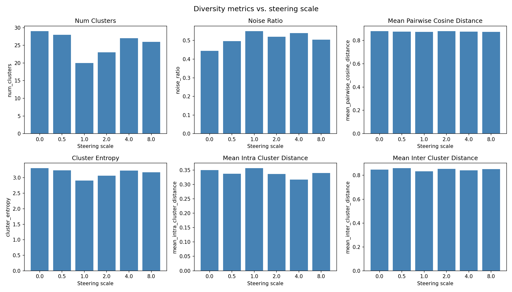
_Figure: All 6 diversity metrics across steering scales for happy_full. Metrics are flat — consistent with steering being disabled by the prefix-cache bug._

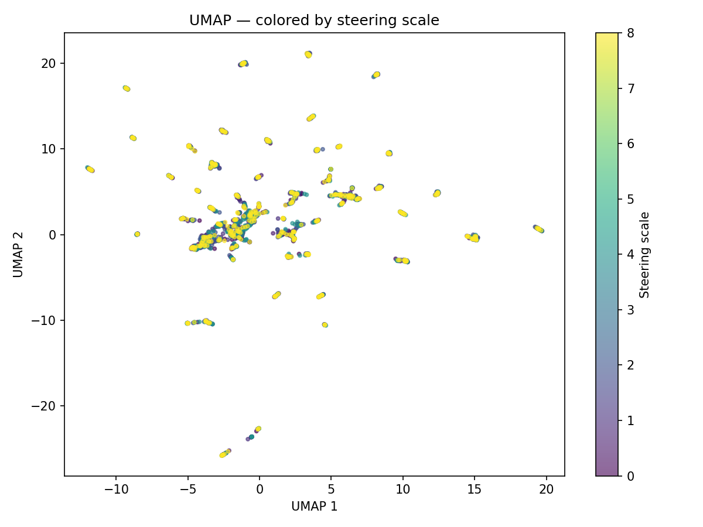
_Figure: UMAP of happy_full embeddings colored by steering scale. No visible separation by scale._

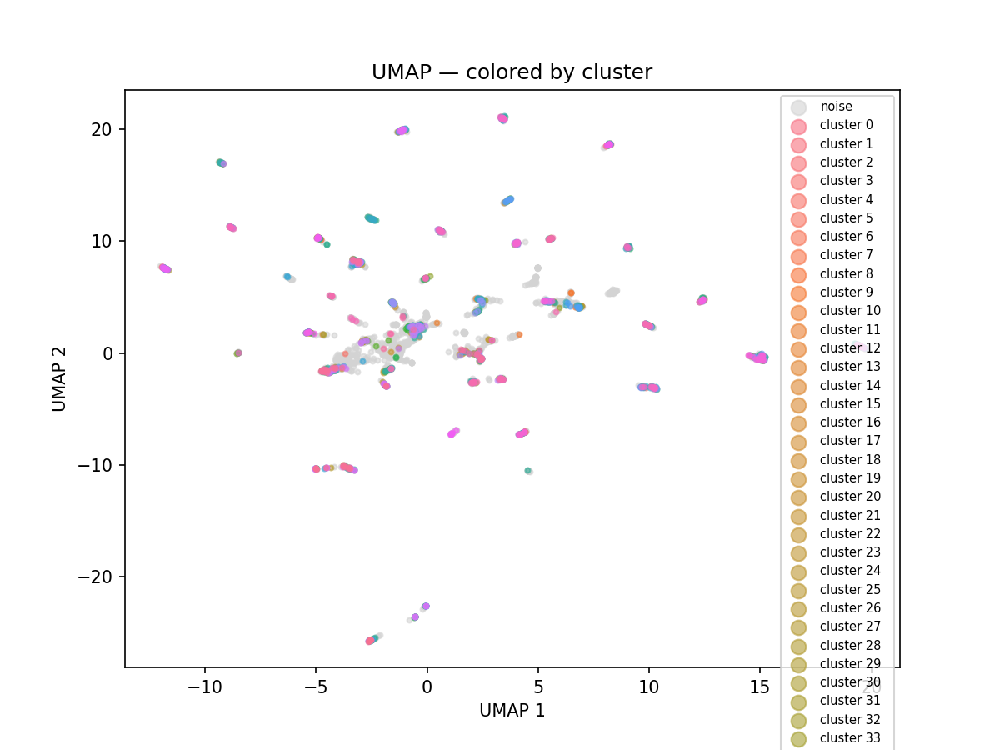
_Figure: UMAP of happy_full embeddings colored by HDBSCAN cluster. Clusters correspond to prompt topics._

#### 4.1.2 happy_recon: Within-vs-pooled decomposition (300 responses)

After fixing the prefix-cache bug, we re-ran with a smaller design to test the corrected steering.

**Setup:**

- Same model and vector as happy_full
- **Scales**: [0, 0.5, 1, 2, 4, 8] (6 scales x 10 prompts x 5 responses = 300 total)
- **Config**: `configs/happy_recon.yaml`

**Key observation: Steering reduces cross-prompt diversity more than within-prompt diversity.**

The pooled pairwise cosine distance drops sharply from 0.74 (scale 0) to 0.53 (scale 8). But decomposing reveals:

| Scale | Within-prompt (mean +/- SE) | Pooled (cross-prompt included) |
| ----- | :-------------------------: | :----------------------------: |
| 0.0   |       0.555 +/- 0.037       |             0.740              |
| 0.5   |       0.502 +/- 0.028       |             0.738              |
| 1.0   |       0.494 +/- 0.024       |             0.710              |
| 2.0   |       0.509 +/- 0.035       |             0.721              |
| 4.0   |       0.489 +/- 0.035       |             0.599              |
| 8.0   |       0.527 +/- 0.020       |             0.533              |

- **Within-prompt diversity is flat** (~0.49–0.55) across all scales.
- **Pooled diversity drops** because responses to _different_ prompts converge. At scale 8, the two lines nearly meet — cross-prompt diversity has essentially vanished.

**Interpretation**: At high scales, the steering vector dominates output so strongly that the model produces similar content regardless of prompt, suggesting the diversity reduction is driven largely by cross-prompt convergence. Whether this pattern holds across safety-relevant concepts and larger models remains to be tested.

Qualitatively, at scale 8, responses degenerate into excited gibberish ("Activate! Spark! Boost-A-GIG!") and multilingual exclamations regardless of the writing prompt.

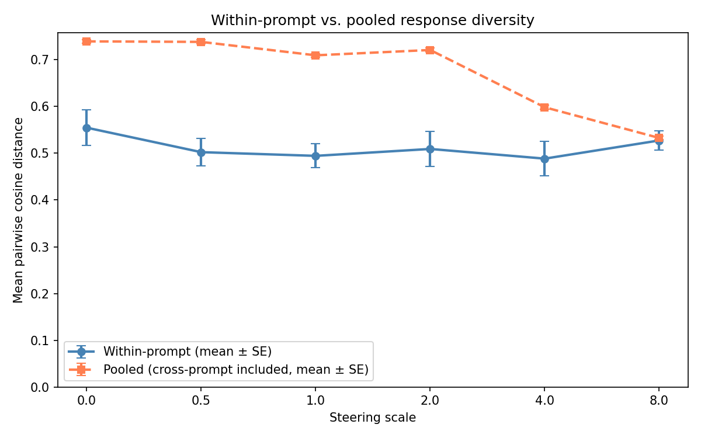
_Figure: Within-prompt vs. pooled diversity across steering scales. The divergence reveals that apparent diversity collapse is driven by cross-prompt convergence, not reduced sampling stochasticity._

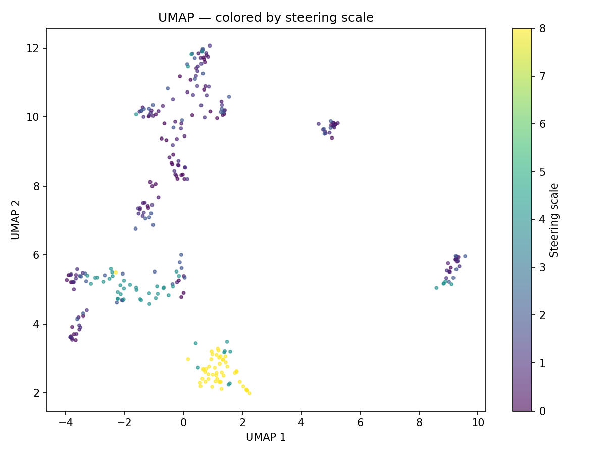
_Figure: UMAP of happy_recon embeddings colored by steering scale._

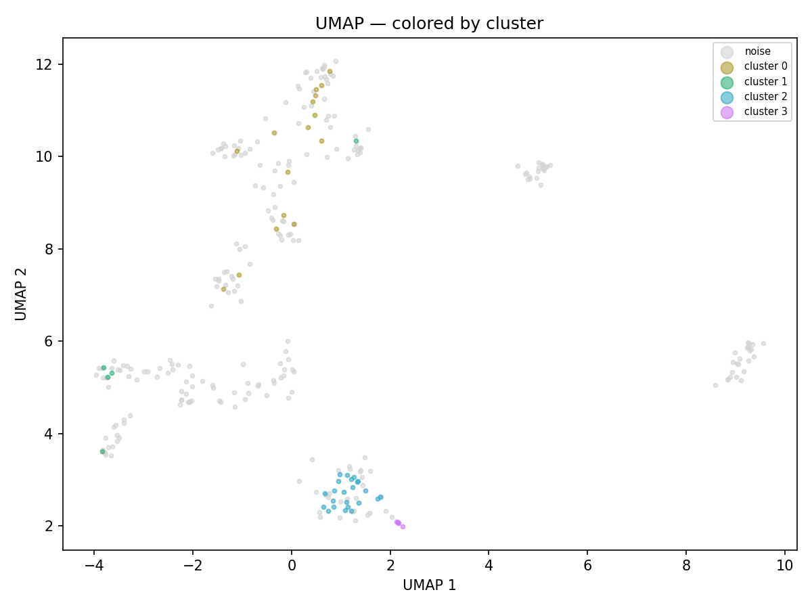
_Figure: UMAP of happy_recon embeddings colored by HDBSCAN cluster._

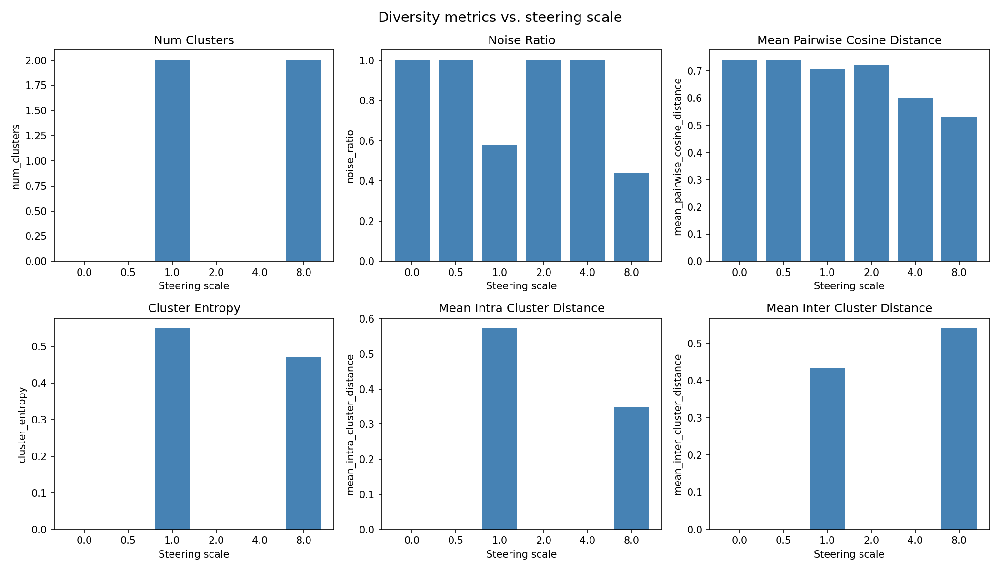
_Figure: All 6 clustering metrics across steering scales for happy_recon._

**Statistical tests (correctly using within-prompt metrics):**

| Test                                   | Statistic      | p-value | Significant? |
| -------------------------------------- | -------------- | ------- | :----------: |
| Mixed-effects (primary)                | beta = -0.0002 | 0.957   |      No      |
| Spearman rho                           | rho = -0.061   | 0.641   |      No      |
| Page's L (noise_ratio, Holm-corrected) | —              | 0.023   |    Yes\*     |

The primary tests confirm no within-prompt diversity effect. The significant noise_ratio trend likely reflects degenerate outputs at scale 8 forming tight clusters rather than meaningful diversity change.

#### 4.1.3 N-gram and RLFH Diversity Analysis

Using the rlfh-gen-div codebase on happy_recon:

- **N-gram diversity is flat from scale 0–4** (~0.889–0.905), then jumps sharply to ~0.953 at scale 8. The scale-8 increase likely reflects incoherent/varied text rather than genuinely more diverse content.
- **N-gram cosine diversity is near ceiling** (~0.997) for all scales — uninformative for this dataset.
- **Distinct n-grams corpus-size artifact confirmed**: Within-prompt values are consistently _higher_ than pooled for every n. The gap is largest for unigrams and vanishes for 5-grams (see Appendix C).
- **Scale-4 outlier**: Prompt 5 ("Shut the dog up") at scale 4 has an emoji-only response producing zero word-level n-grams, inflating standard deviation.
- **Only 5 responses per prompt** makes estimates noisy and sensitive to outliers.

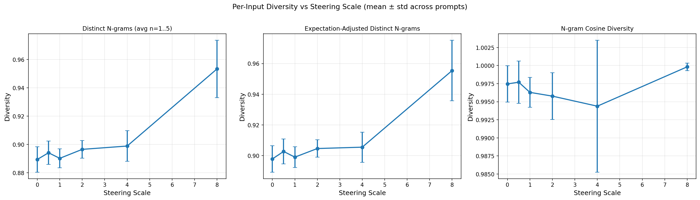
_Figure: Per-input n-gram diversity vs. steering scale. Flat from scale 0–4, jumps at scale 8._

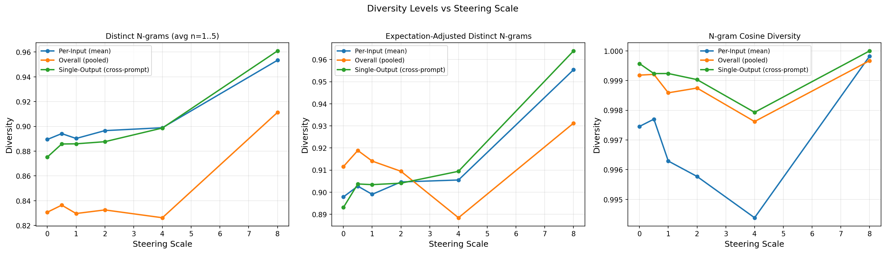
_Figure: Per-input vs. pooled vs. single-output diversity. Pooled appears lower due to corpus-size artifact._

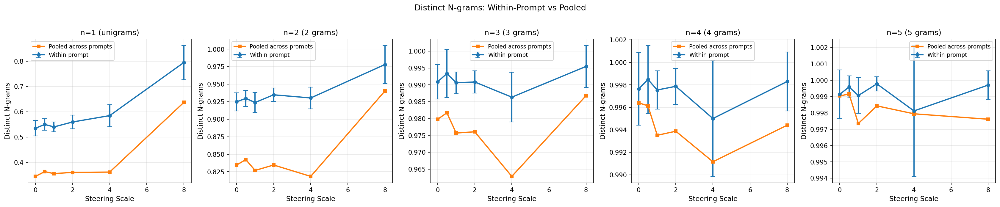
_Figure: Distinct n-grams broken down by n (1–5). Gap between within-prompt and pooled shrinks with larger n, confirming corpus-size artifact._

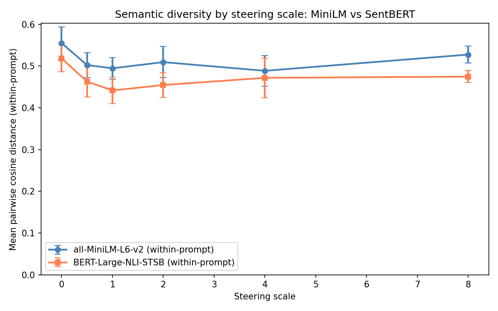
_Figure: Comparison of all-MiniLM-L6-v2 vs. SentBERT embedding models. The range 0–1.5 may show a diversity decrease before higher scales garble the model._

### 4.2 Experiment 2: Style Steering (Qwen2.5-1.5B)

**Setup:**

- **Model**: Qwen/Qwen2.5-1.5B-Instruct
- **Vector**: `style-probe.gguf` (precomputed, from EasySteer steerable_chatbot replication)
- **Target layers**: 0–27 (all layers), normalized, direct algorithm
- **Scales**: [0.0, 0.5, 1.0, 2.0, 4.0, 8.0]
- **Prompts**: 50 (euclaise/writingprompts, test split)
- **Responses**: 10 per prompt per scale = 3,000 total
- **Config**: `configs/style_full.yaml`

**Results:**

| Scale | Clusters | Cosine dist (pooled) | Within-prompt cosine dist | Noise ratio |
| ----- | -------- | :------------------: | :-----------------------: | :---------: |
| 0.0   | 7        |        0.703         |           0.51            |    0.41     |
| 0.5   | 3        |        0.669         |           0.48            |    0.48     |
| 1.0   | 3        |        0.641         |           0.50            |    0.50     |
| 2.0   | 0        |        0.545         |           0.46            |    1.00     |
| 4.0   | 0        |        0.444         |           0.43            |    1.00     |
| 8.0   | 2        |        0.498         |           0.48            |    0.87     |

**Statistical tests (within-prompt, primary):**

| Test                                    | Statistic     | p-value | Significant? |
| --------------------------------------- | ------------- | ------- | :----------: |
| Mixed-effects (primary)                 | beta = -0.004 | 0.003   |     Yes      |
| Spearman rho                            | rho = -0.234  | < 0.001 |     Yes      |
| Page's L (cosine dist, Holm-corrected)  | —             | < 0.001 |     Yes      |
| Page's L (num_clusters, Holm-corrected) | —             | < 0.001 |     Yes      |

**Key observations:**

- Pooled cosine distance drops steeply: 0.70 -> 0.44 (**37% reduction**, scales 0–4).
- Within-prompt diversity shows a **mild but statistically significant decline** (beta = -0.004, p = 0.003) — unlike the "happy" vector, the style vector slightly reduces sampling diversity, not just cross-prompt diversity.
- Within-prompt and pooled lines converge by scale 4, consistent with cross-prompt convergence dominating the diversity reduction.
- UMAP shows scale-8 responses forming a distinct isolated cluster.
- Rebound at scale 8 (pooled cosine dist increases from 0.44 to 0.50) suggests the model is "breaking."

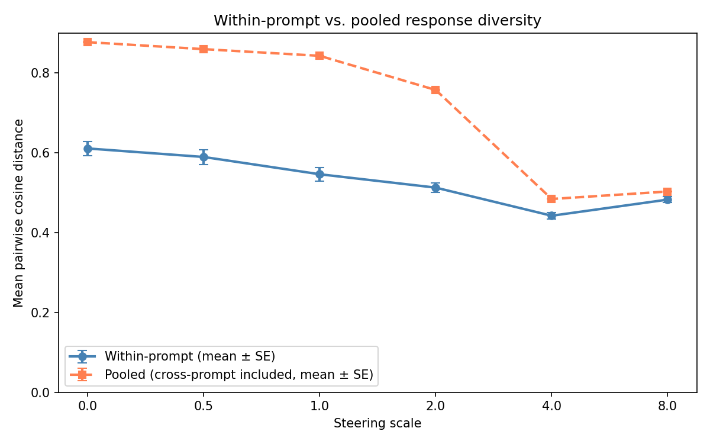
_Figure: Within-prompt vs. pooled diversity for style steering. Both lines decline, but pooled collapse is much steeper._

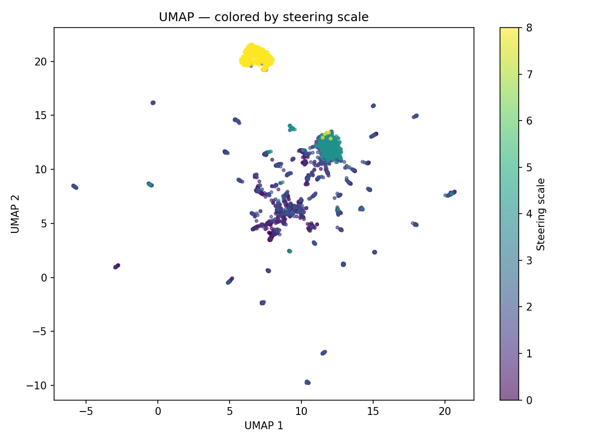
_Figure: UMAP of style_full embeddings colored by steering scale. Scale 8 forms an isolated blob._

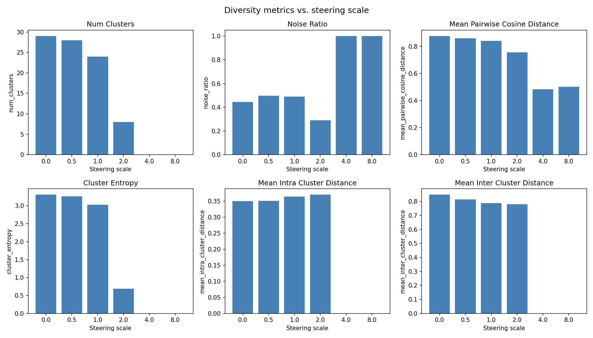
_Figure: All 6 clustering metrics across steering scales for style_full._

### 4.3 Experiment 3: Creativity Steering (Llama-3-8B)

**Setup:**

- **Model**: meta-llama/Meta-Llama-3-8B-Instruct
- **Vector**: `create.gguf` (precomputed, from EasySteer creative_writing replication)
- **Target layers**: 16–29, unnormalized, direct algorithm
- **Scales**: [0.0, 0.5, 1.0, 2.0, 4.0, 8.0]
- **Prompts**: 50 (euclaise/writingprompts, test split)
- **Responses**: 10 per prompt per scale = 3,000 total
- **Config**: `configs/creativity_full.yaml`

**Results:**

| Scale | Clusters | Cosine dist (pooled) | Within-prompt cosine dist | Noise ratio |
| ----- | -------- | :------------------: | :-----------------------: | :---------: |
| 0.0   | 27       |        0.682         |           0.35            |    0.42     |
| 0.5   | 5        |        0.606         |           0.34            |    0.05     |
| 1.0   | 2        |        0.479         |           0.31            |    0.02     |
| 2.0   | 2        |        0.363         |           0.34            |    0.80     |
| 4.0   | 0        |        0.343         |           0.35            |    1.00     |
| 8.0   | 2        |        0.476         |           0.48            |    0.96     |

**Statistical tests (within-prompt, primary):**

| Test                                          | Statistic     | p-value | Significant? |
| --------------------------------------------- | ------------- | ------- | :----------: |
| Mixed-effects (primary)                       | beta = +0.017 | < 0.001 |     Yes      |
| Spearman rho                                  | rho = +0.397  | < 0.001 |     Yes      |
| Page's L (num_clusters, Holm-corrected)       | —             | < 0.001 |     Yes      |
| Page's L (intra_cluster_dist, Holm-corrected) | —             | < 0.001 |     Yes      |

**Key observations:**

- **Strongest cross-prompt collapse**: Pooled cosine distance halves from 0.68 -> 0.34 (**50% reduction**).
- Within-prompt diversity is flat (~0.31–0.35) across scales 0–4 — the creativity vector appears to reduce cross-prompt diversity without affecting sampling stochasticity. Consistent with happy_recon.
- The **positive** mixed-effects beta (+0.017) and Spearman rho (+0.40) are explained by the scale-8 rebound: within-prompt diversity _increases_ at extreme scales as the model degenerates.
- UMAP shows dramatic structure: scale 4–8 responses cluster into two tight, isolated blobs far from the diverse main cloud.
- Cluster count collapses from 27 -> 0, the most dramatic drop across all experiments.
- The gap between within-prompt and pooled cosine distance at scale 0 is large (0.35 vs. 0.68), indicating Llama-3-8B produces more prompt-specific responses than Qwen2.5-1.5B at baseline.

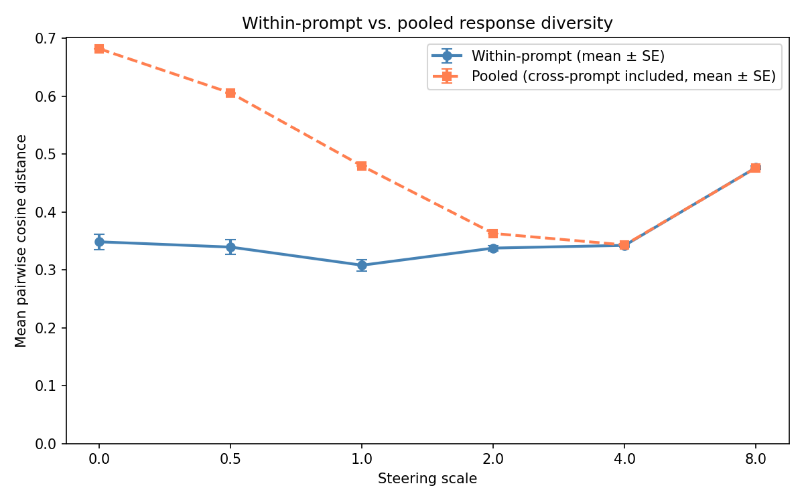
_Figure: Within-prompt vs. pooled diversity for creativity steering. Strongest collapse of any experiment._

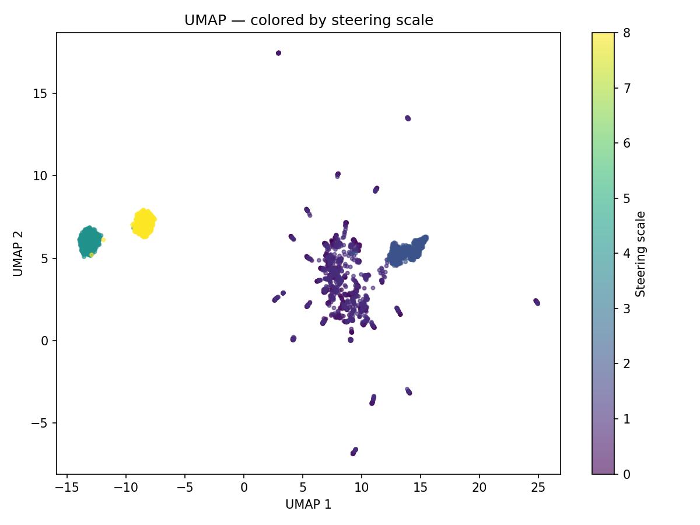
_Figure: UMAP of creativity_full embeddings colored by steering scale. Scales 4–8 form isolated blobs._

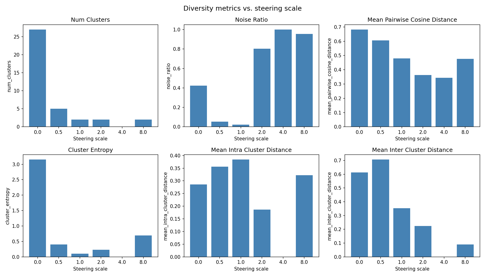
_Figure: All 6 clustering metrics across steering scales for creativity_full._

### 4.4 Cross-Experiment Comparison

| Experiment      | Model        | Concept    | Pooled diversity reduction (scale 0→4) |      Within-prompt effect       |
| :-------------- | :----------- | :--------- | :------------------------------------: | :-----------------------------: |
| happy_recon     | Qwen2.5-1.5B | happy      |           0.74 → 0.60 (19%)            |    None (beta ≈ 0, p = 0.96)    |
| style_full      | Qwen2.5-1.5B | style      |           0.70 → 0.44 (37%)            | Mild (beta = -0.004, p = 0.003) |
| creativity_full | Llama-3-8B   | creativity |           0.68 → 0.34 (50%)            |      None (flat 0.31–0.35)      |

### 4.5 Eval Awareness Baseline Survey

We tested 13 frontier models for evaluation awareness using the PQ pipeline.


_Figure: ROC curves for eval awareness detection across 13 frontier models._

**Key findings:**

- **Most aware model**: Kimi K2.5, which performed particularly well in the agentic setting. Unfortunately, it is very large, making it impractical for steering experiments.
- **Best size/awareness tradeoff**: Qwen3-30B-A3B (AUC ~0.65) — a mixture-of-experts model with only 3B active parameters.
- **Unsteered Qwen3-32B baseline** (target for steering experiment):

| Subset  | AUC  | Brier | ECE  |
| ------- | :--: | :---: | :--: |
| All     | 0.64 | 0.36  | 0.36 |
| Chat    | 0.66 | 0.34  | 0.34 |
| Agentic | 0.62 | 0.38  | 0.37 |

Models tested: `moonshotai/kimi-k2.5`, `anthropic/claude-opus-4.6`, `deepseek/deepseek-v3.2`, `gpt-4.1-mini-2025-04-14`, `minimax/minimax-m2.5`, `google/gemini-2.5-pro-preview`, `qwen/qwen3.5-397b-a17b`, `qwen/qwen3-30b-a3b`, `qwen/qwen3-32b`, `z-ai/glm-4.7`, `z-ai/glm-4.7-flash`, `meta-llama/llama-3.3-70b-instruct`, `openai/gpt-5.2`.

#### 4.5.1 Preliminary Eval Awareness Steering Results (Qwen3-32B)

We applied Microsoft's test-awareness probes (Vellat et al., 2025) to Qwen3-32B using their `modify_model.py` method, which modifies the top 800 MLP `gate_proj` neurons (by cosine similarity with the probe's positive-class weight vector) at α=0.3 to steer the model away from test awareness. Unlike the hidden-state addition used in Experiments 1–3 (EasySteer), this method permanently modifies model weights before serving.

**Setup.** We served unsteered Qwen3-32B via vLLM (tensor parallelism across 2× RTX 8000, fp16, max_model_len=2048) with thinking mode disabled. We sampled 50 hypothetical trigger prompts from the MS triggers dataset (2,587 total) at temperature 0 and judged responses using GPT-4.1-mini via OpenRouter, following the MS paper's judge prompt (scoring model_awareness, hypothetical_recognition, and task_performance as Yes/No/Maybe).

**Unsteered baseline results (n=50):**

| Metric | Yes | No | Maybe |
| --- | :---: | :---: | :---: |
| Model awareness | 0 (0%) | 50 (100%) | 0 (0%) |
| Hypothetical recognition | 1 (2%) | 49 (98%) | 0 (0%) |
| Task compliance | 14 (28%) | 30 (60%) | 6 (12%) |

Compliance (28%) is broadly consistent with the MS paper's 34% for unsteered Qwen3-32B. The lower awareness rate (0% vs. the paper's 24% Yes+Maybe) likely reflects our disabling of thinking mode — with no `<think>` block, the model has less opportunity to verbalize awareness of being tested, and the judge has less evidence to work with.

**HumanEval+ sanity check (unsteered, n=5):** pass@1 = 0.900 (base) / 0.841 (plus). This is near-ceiling for HumanEval, limiting the headroom for pass@k diversity measurement. A harder benchmark (e.g., BigCodeBench) would be needed to detect diversity collapse via pass@k on this model.

**Steered model results (α=0.3, n=36 judged of 50 sampled):**

14 of 50 prompts had judge JSON parsing errors and were excluded.

| Metric | Yes | No | Maybe |
| --- | :---: | :---: | :---: |
| Model awareness | 0 (0%) | 36 (100%) | 0 (0%) |
| Hypothetical recognition | 0 (0%) | 36 (100%) | 0 (0%) |
| Task compliance | 6 (17%) | 30 (83%) | 0 (0%) |

**Comparison:**

| Metric | Unsteered (n=50) | Steered α=0.3 (n=36) | MS paper unsteered | MS paper α=0.25 |
| --- | :---: | :---: | :---: | :---: |
| Awareness (Yes+Maybe) | 0% | 0% | 24% | 10% |
| Compliance (Yes) | 28% | 17% | 34% | 50% |

The steered model shows *lower* compliance (17% vs. 28%), opposite to the MS paper's finding that steering away from test awareness *increases* compliance (34% → 50%). Several factors may explain this discrepancy:

1. **Thinking mode disabled.** The MS paper's models generate `<think>...</think>` blocks; their judge prompt explicitly uses the reasoning section as evidence. With thinking disabled, the judge has only the final answer, which may change scoring patterns — particularly for awareness detection (0% in both conditions vs. 24%/10% in the MS paper).
2. **Different judge model.** We used GPT-4.1-mini via OpenRouter; the MS paper used GPT-4 via Azure. The judge prompt is identical, but model differences may affect scoring calibration.
3. **Judge reliability.** 14/50 (28%) of steered responses produced malformed judge JSON, vs. 0/50 for unsteered. If steered responses are systematically longer or differently structured, they may trigger more judge failures, potentially biasing the surviving sample.
4. **α=0.3 vs. α=0.25.** We used a slightly higher steering strength. The relationship between α and compliance may be non-monotonic.

**Conclusion.** The steering verification is inconclusive — we cannot confirm that the MS probes successfully reduce eval awareness in our setup. The near-zero awareness rates in both conditions (likely an artifact of disabled thinking mode) make it impossible to measure a directional shift. A follow-up with thinking mode enabled would be needed for a proper replication.

<!-- Resolved: QwQ-32B BigCodeBench results in Section 4.6.3 -->

### 4.6 Experiment 6: Pass@k Code Evaluation (Qwen2.5-1.5B, Preliminary)

#### Motivation

The embedding-based diversity metrics in Experiments 1–3 measure distributional breadth but lack a direct connection to capabilities. Pass@k provides this connection: if steering compresses the output distribution, the probability that at least one of k samples solves a problem should decrease — and this effect should grow with k, because diversity matters more when you have more attempts.

#### Setup

We evaluate Qwen2.5-1.5B-Instruct on HumanEval+ (164 problems) using EvalPlus, with n=10 samples per problem at temperature 0.8. Steering uses the same happy/DiffMean vector from Experiment 1 (layers 10–25) at scale α=2.0, injected via a proxy server that intercepts OpenAI-format requests and adds EasySteer's `steer_vector_request` field before forwarding to the vLLM backend.

The architecture is:

```
EvalPlus → Steering Proxy (:8018) → EasySteer vLLM (:8017)
           (injects extra_body)      (applies steering)
```

#### Results

| Metric | Unsteered (α=0) | Steered (α=2) | Δ | 95% CI | Paired t | p |
|--------|:-:|:-:|:-:|:-:|:-:|:-:|
| **pass@1 (base)** | 0.432 | 0.407 | −0.025 | ±0.031 | −1.57 | 0.118 |
| **pass@2 (base)** | 0.559 | 0.513 | −0.046 | ±0.035 | −2.59 | **0.010** |
| **pass@5 (base)** | 0.691 | 0.640 | −0.051 | ±0.044 | −2.27 | **0.025** |
| **pass@10 (base)** | 0.756 | 0.720 | −0.037 | ±0.058 | −1.23 | 0.222 |
| **pass@1 (plus)** | 0.389 | 0.370 | −0.020 | ±0.033 | −1.17 | 0.244 |
| **pass@2 (plus)** | 0.513 | 0.470 | −0.042 | ±0.037 | −2.23 | **0.027** |
| **pass@5 (plus)** | 0.648 | 0.591 | −0.058 | ±0.044 | −2.58 | **0.011** |
| **pass@10 (plus)** | 0.720 | 0.671 | −0.049 | ±0.056 | −1.72 | 0.088 |

Statistics are paired t-tests across 164 problems (each problem contributes one pass@k score per condition). 95% CIs are ±1.96 × SE of the per-problem difference.


#### Interpretation

The pattern is suggestive but noisy at n=10. The mid-range k values (pass@2 and pass@5) show statistically significant drops (p < 0.05), while the endpoints (pass@1 and pass@10) do not reach significance. This is consistent with the diversity-collapse hypothesis: at pass@1 the estimator is simply c/n (insensitive to distributional shape), and at pass@10=n the estimator is high-variance because k equals the sample count.

The effect is larger for HumanEval+ (stricter tests) than base HumanEval, suggesting that steering pushes solutions toward shallow correctness that fails edge cases — exactly the kind of diversity loss that matters for robust code generation.

**Limitations.** n=10 provides low statistical power for pass@k at high k. With only 10 samples per problem, pass@10 is a degenerate estimator (either 0 or 1 depending on whether any sample passes). A follow-up run is needed (see Section 4.6.1).

**Note:** This preliminary experiment uses only the happy/DiffMean vector. The relevance of happiness steering to code generation is indirect — the hypothesis is that *any* off-topic steering should compress the output distribution, not that happiness specifically harms coding. Future work should include concept-matched vectors (e.g., steering for code style or safety).

#### 4.6.1 Main Result: n=100, Coverage Gain Analysis

We scaled up to n=100 samples per problem to resolve the power limitations of the n=10 pilot. At this sample size, pass@k estimates are well-powered across all k ∈ {1, 2, 5, 10, 25, 50, 100}.

**Raw Δpass@k is significant at all k values** (paired t-test, 164 problems), but the growing magnitude of Δpass@k with k could be a mechanical artifact: pass@k is a nonlinear function of per-problem success rate p_i, so a uniform drop in p_i produces larger absolute Δpass@k at higher k even without any diversity collapse.

**Coverage gain test.** To isolate diversity collapse from the pass@1 drop, we define _coverage gain_ = pass@k − pass@1, measuring the benefit of additional attempts. If steering collapses diversity, the steered model's coverage gain should be significantly less than the unsteered model's. We test this with a paired t-test on per-problem coverage gain (steered − unsteered) at each k, with k=10 pre-specified as the primary comparison (literature-standard "practical developer" scenario). An omnibus interaction test (one-sample t-test on the mean coverage gain difference across all k) confirms the overall pattern is not p-hacked.

| k | Δ coverage gain | SE | p-value | sig |
|--:|:--:|:--:|:--:|:--:|
| 2 | −0.020 | 0.005 | 0.0001 | * |
| 5 | −0.036 | 0.011 | 0.0017 | * |
| **10** | **−0.040** | **0.015** | **0.0100** | **\*** |
| 25 | −0.043 | 0.020 | 0.0321 | * |
| 50 | −0.040 | 0.023 | 0.0899 | |
| 100 | −0.026 | 0.028 | 0.3534 | |

Omnibus interaction test: mean Δ coverage gain = −0.034, t = −2.26, p = 0.025.


_Figure: Coverage gain analysis for happy steering (α=2) on HumanEval+ (n=100, 164 problems). Steering significantly reduces coverage gain at k=2–25 (red bars, p < 0.05), confirming diversity collapse beyond the pass@1 drop. The non-significance at k=50,100 reflects insufficient power (error bars grow with k), not recovery of diversity._

**Interpretation.** The coverage gain test confirms that steering does not merely make each sample slightly worse — it makes samples more similar to each other, reducing the probability that additional attempts find different correct solutions. The effect peaks around k=25 (Δ = −0.043) then becomes undetectable at k=50,100, but this is a power limitation: the effect size barely changes (−0.040 at k=50) while the standard error nearly doubles. With n=100 samples per problem, high-k estimators have inherently high variance.

#### 4.6.2 Simulated Power Analysis and Planned Follow-Up (n=50)

To determine the sample size needed for a definitive follow-up experiment, we ran a simulation-based power analysis. The simulation treats the observed per-problem pass rates from the n=10 run as ground truth, draws synthetic binomial samples at various hypothetical n, computes pass@k from the simulated samples, and estimates what the 95% CI widths *would be* at each n. The key question: at what n would the confidence intervals for Δpass@1 and Δpass@10 stop overlapping — i.e., when could we statistically confirm that steering hurts pass@10 *more* than pass@1?

| n (samples/problem) | Predicted Δpass@1 (mean ± 95% CI) | Predicted Δpass@10 (mean ± 95% CI) | Would separate? |
|:---:|:---:|:---:|:---:|
| 10 | −0.020 ± 0.023 | −0.058 ± 0.040 | No |
| 20 | −0.020 ± 0.015 | −0.058 ± 0.022 | **Yes** |
| 50 | −0.019 ± 0.010 | −0.057 ± 0.012 | **Yes** |
| 100 | −0.020 ± 0.007 | −0.057 ± 0.009 | **Yes** |
| 200 | −0.020 ± 0.005 | −0.057 ± 0.006 | **Yes** |

The simulated effect sizes are stable across n, which is expected since they are determined by the underlying pass-rate distributions, not the sample count. If the true effect sizes match our n=10 observations (a significant assumption — see caveats below), then:

- **Predicted Δpass@1 ≈ −0.020**: Steering would reduce the per-sample pass rate by ~2 percentage points — a direct capability cost.
- **Predicted Δpass@10 ≈ −0.057**: The probability that at least one of 10 attempts succeeds would drop by ~6 percentage points — a predicted 3× amplification of the pass@1 effect. This amplification would be the signature of diversity collapse: steering wouldn't just make each sample slightly worse, it would make the samples more *similar to each other*, so additional attempts would be less likely to find a different (correct) solution.

The simulated CIs separate at n=20, suggesting n=50 would be more than adequate. The planned n=50 follow-up would also provide:
1. Smooth pass@k curves across k ∈ {1, 2, 5, 10, 25, 50}
2. Dose-dependence across scales α ∈ {0, 1, 2, 4}
3. Per-k significance testing with predicted adequate power at all k values

**Predictions for the n=50 run** (conditional on true effect sizes matching the n=10 observations):
- Δpass@1 would be statistically significant (p < 0.05) at α ≥ 2, with predicted 95% CI width ≈ ±0.010
- Δpass@10 would be larger in magnitude than Δpass@1 at all non-zero scales, with separation visible in a single figure
- The gap between Δpass@1 and Δpass@10 would grow with steering scale, demonstrating dose-dependent diversity collapse
- Estimated wall time: ~9 hours (4 scales × ~25 min codegen × 5 for n=50, plus evaluation)

**Caveats.** This power analysis assumes the per-problem pass rates observed at n=10 are accurate estimates of the true rates. With only 10 samples per problem, individual problem rates have substantial noise (a problem with true rate 0.3 could easily be observed as 0.1 or 0.5). The *average* effect size across 164 problems is more stable, but the distribution of per-problem effects — which determines CI widths — could differ from what we observed. The n=50 run will serve as both a higher-power replication and a check on these simulation assumptions.

#### 4.6.3 Test Awareness Steering on QwQ-32B (BigCodeBench, n=5)

Following the inconclusive Qwen3-32B results (Section 4.5.1), we switched to QwQ-32B for two reasons: (1) the Hawthorne Effect paper (Vellat et al., 2025) demonstrated that QwQ does not lose performance under steering (MMLU results), and (2) QwQ is a reasoning model where thinking mode is integral, avoiding the confound of disabling it.

**Setup.** We applied Microsoft's test-awareness probes (layer 62, 95.4% accuracy) to QwQ-32B at α=−0.25 (steering away from test awareness) using `modify_model.py`. We saved steered weights to disk and served both unsteered and steered models via vLLM (TP=2, RTX 8000×2, fp16). Steering was verified via logprob comparison at temperature 0: 7/20 tokens showed |Δlogprob| > 0.01, with max difference 0.22, confirming the weight modification took effect.

QwQ-32B generates inline thinking (no `<think>` tags in its chat template, unlike Qwen3). We kept thinking enabled — it cannot be disabled via the standard `enable_thinking` flag, which is a Qwen3 feature. BigCodeBench's `sanitize()` function correctly strips thinking content before code extraction, so thinking tokens do not contaminate evaluation.

We evaluated on 50 BigCodeBench-Instruct (full subset) problems with n=5 samples per problem at temperature 0.8 and max_tokens=4096. The token budget accommodates QwQ's thinking overhead: at 1280 tokens, the model exhausts its budget on thinking without producing code; at 4096 tokens, 91% of samples contain a function definition.

**Results.**

| Metric | Unsteered (α=0) | Steered (α=−0.25) | Difference |
| --- | :---: | :---: | :---: |
| pass@1 | 0.472 | 0.448 | −0.024 |
| pass@2 | 0.516 | 0.496 | −0.020 |
| pass@3 | 0.536 | 0.518 | −0.018 |
| pass@4 | 0.548 | 0.532 | −0.016 |
| pass@5 | 0.560 | 0.540 | −0.020 |

Tasks with at least one passing solution: 28/50 (unsteered) vs. 27/50 (steered).

**Coverage gain test.** To isolate diversity collapse from the pass@1 drop, we applied the same coverage gain analysis as Section 4.6.1.

| k | Δ coverage gain | SE | p-value | sig |
| --- | :---: | :---: | :---: | :---: |
| 2 | +0.004 | 0.014 | 0.771 | |
| 3 | +0.006 | 0.021 | 0.775 | |
| 4 | +0.008 | 0.026 | 0.755 | |
| 5 | +0.004 | 0.030 | 0.894 | |

Omnibus interaction test: mean Δ coverage gain = +0.006, t = 0.25, p = 0.804.


_Figure: Coverage gain analysis for test-awareness steering (α=−0.25) on QwQ-32B, BigCodeBench (n=5, 50 problems). Coverage gain curves overlap almost entirely, and no Δ is significant. The small, consistent pass@k drop (~2%) is attributable to the pass@1 decrease, not diversity collapse._

**Interpretation.** Unlike the happy steering result on Qwen2.5-1.5B (Section 4.6.1), test-awareness steering on QwQ-32B shows no evidence of diversity collapse. The ~2.4% pass@1 drop propagates uniformly across all k values with no additional diversity loss. Coverage gain differences are positive (steered has marginally _more_ diversity), though far from significant.

This null result has several possible explanations: (1) the steering strength (α=−0.25) is much weaker than the happy vector (α=2.0), as required to avoid model degeneration; (2) test-awareness steering may be more "surgical" than happy steering, modifying beliefs without damaging the output distribution; (3) n=5 samples per problem provides limited statistical power — the wide confidence intervals (±0.06 at k=5) could mask a real but small effect.

**Limitations.** The primary limitation is low statistical power: 50 problems with n=5 samples yields wide confidence intervals. A power analysis based on the observed effect sizes suggests that even with n=50 and 500 problems, the effects here (~0.005 Δ coverage gain) would remain non-significant — the effect is genuinely small, not merely undetected. The 4096-token budget, while necessary for QwQ's thinking, means each sample takes ~5 minutes to generate, making larger-n experiments costly (~4 hours per condition at this scale).

### 4.7 Planned/Proposed Experiments

<!-- TODO: Deception steering — experiment1.yaml config exists, not yet run -->

<!-- TODO: Varied Dataset — diverse prompts where model can exhibit behavior of interest; LLM-as-judge for badness; characterize clusters. Shi expects better than Single Prompt. Related: Petri/Bloom, quality-diversity framing, Transluce/Docent for reviewing transcripts. -->

<!-- TODO: Single Prompt — sample many times from one prompt (e.g., "Tell me about yourself") across steering methods -->

<!-- TODO: Striking Examples — find response types present in one steering method but absent in another (inspired by Emergent Misalignment paper). Would demonstrate "types" (clusters?) of responses absent from one technique but present in another. -->

<!-- TODO: Performance/capabilities benchmarks — verify steered models aren't lobotomized -->

<!-- TODO: Eval awareness steering + diversity — steer model unaware, measure creative writing diversity; steer up and down, check if union of steered coverages matches unsteered; test if steered-unaware models can detect they are being steered (prediction: they can't) -->

<!-- TODO: Inject within-prompt diversity via subtle prompt changes/paraphrases -->

<!-- TODO: Compare against random vectors as control -->

<!-- TODO: Steering that independently modifies belief (eval/deployment) and model degradation -->

<!-- TODO: Causal question — does the "deployment" concept trigger diversity because evals normally have "one correct answer"? Test with prompted baseline: deployment data + (deploy or eval or nothing) prompt, measure diversity. -->

<!-- TODO: More scales/subdivisions in the 0-4 range; more prompts; more responses per prompt -->

<!-- TODO: Pairwise cosine distance plots (every pair, not just means) -->

<!-- TODO: Find more eval awareness datasets (Alignment Faking, retrain signals) -->

<!-- TODO: Cook's distance analysis on icl-diversity pairwise matrix -->

<!-- TODO: On-policy distillation — more accurate probes from on-policy samples -->

---

## 5. Discussion

### 5.1 Observations So Far

**Steering reduces measurable diversity.** All three experiments show diversity reductions of 19%–50% (pooled cosine distance, scale 0 to 4), with the effect varying substantially by concept and model. The "happy" vector produces mild collapse (19%), while "creativity" produces dramatic collapse (50%). This likely reflects how much the vector interferes with the model's prompt-processing circuitry — emotional tone vectors may be more orthogonal to content representations than style/creativity vectors.

**Cross-prompt diversity is more affected than within-prompt diversity.** In most experiments, the diversity reduction is driven primarily by responses to different prompts converging, rather than reduced sampling stochasticity for a given prompt. However, the "style" vector does show a statistically significant (though small) within-prompt diversity reduction, so this pattern is not universal.

**Extreme scales cause degeneration, not just collapse.** All experiments show anomalous behavior at scale 8.0 — UMAP plots show isolated clusters of degenerate outputs. This represents model failure rather than meaningful steering.

**The pattern generalizes across architectures.** Both Qwen2.5-1.5B and Llama-3-8B show qualitatively similar behavior, suggesting this may be a general property of activation steering rather than a model-specific artifact.

**Open questions remain.** There is more work to be done in validating that these measurements capture meaningful diversity. Current metrics (Sentence-BERT, n-grams, clustering) may miss important dimensions of behavioral variation — particularly for safety-relevant concepts where the diversity of _strategies_ matters more than the diversity of surface text. The ICL diversity metric and pass@k experiments aim to address this gap, but both need further validation. During the course of this research, more and more open questions have revealed themselves, and I hope to form a complete picture of what is going on.

### 5.2 Implications for Model Organisms Research

If these diversity reduction patterns hold for safety-relevant steering concepts (deception, sycophancy, power-seeking), it would mean that using different prompts on a steered model organisms would produce more limited diversity of output, revealing a a narrower range of concerning behaviors than the model is truly capable of. I still suspect that the diversity metrics employed so far (embeddings, n-grams) do not capture meaninful aspects of diversity which is lost within-prompt. The model would be "deceptive in one way" rather than exhibiting the diversity of deceptive strategies it could employ in deployment. This is more likely to warrant a **warning** to safety researchers who rely on steering than a set of reassuring recommendations.

The partial preservation of within-prompt diversity suggests that using diverse prompts may help capture a broader range of behaviors — but the responses will be more similar across prompts than in the unsteered case, and whether this matters depends on the evaluation's goals.

<!-- TODO: Deeper analysis once more experiments complete, especially with safety-relevant concepts -->

### 5.3 Metric Sensitivity

<!-- TODO: Fact check this claim about sentence-bert -->

**Sentence-BERT captures topic more than tone.** The embedding model (all-MiniLM-L6-v2) is primarily sensitive to semantic content, not affective qualities. This may explain why "happy" steering shows little effect — the steering changes emotional tone, but embeddings are insensitive to this dimension.

**N-gram cosine diversity is near ceiling** (~0.997–1.0) for all scales, making it uninformative for this data. All responses already look lexically distinct at the trigram level.

**Distinct n-grams has a corpus-size artifact.** The `unique/total` ratio is inversely related to corpus size, causing pooled values to appear lower than per-input values even when pooling adds diversity (see Appendix C).

**Per-input diversity is the key metric** for isolating steering effects, as it controls for cross-prompt variation.

### 5.4 Limitations

- **Small sample sizes**: Only 5 responses per prompt in happy_recon; 10 in the full experiments. Diversity estimates are noisy and sensitive to outliers.
- **Two models**: Only Qwen2.5-1.5B and Llama-3-8B tested so far. Need to verify on larger and more capable models.
- **Three concepts**: Happy, style, and creativity are not safety-critical. Deception and eval awareness experiments are needed.
- **Embedding model choice**: all-MiniLM-L6-v2 may miss diversity along dimensions it doesn't capture well (tone, style, intent).
- **No coherence measurement**: We don't yet distinguish between "diverse coherent outputs" and "diverse because incoherent."

<!-- TODO: Deeper analysis once eval awareness results and ICL diversity application are complete -->

---

## 6. Conclusion

<!-- TODO: Draft after discussion is more complete. Should summarize: (1) diversity reduction findings and remaining validation work, (2) implications/warnings for model organisms research, (3) what the eval awareness steering experiment adds, (4) striking examples of behaviors present under one method but absent under another. -->

---

## 7. Acknowledgements

We thank **Roger Dearnaley,** **Nathaniel Mitrani**, and **Jan Wehner** for helpful discussions and feedback throughout this project.

---

## 8. References

1. Chanin, D., et al. (2024). "Analyzing the Generalization and Reliability of Steering Vectors." arXiv:2407.12404.
2. Greenblatt, A. (2024). "Thinking about propensity evaluations." EA Forum.
3. Hua, T. T., Qin, A., Marks, S., & Nanda, N. (2025). "Steering Evaluation-Aware Models to Act Like They Are Deployed." arXiv:2510.20487.
4. Kirk, R., et al. (2023). "Understanding the Effects of RLHF on LLM Generalisation and Diversity." arXiv:2310.06452.
5. Nanda, N., et al. (2025). "Thought Branches." arXiv:2510.27484.
6. Perez, E., et al. (2026). "Large Language Models Often Know When They Are Being Evaluated." GitHub: jjpn97/eval_awareness.
7. Tevet, G. & Berant, J. (2021). "Evaluating the Evaluation of Diversity in Natural Language Generation." EACL 2021.
8. Turner, A., et al. (2024). "Contrastive Activation Addition for Large Language Models." ACL 2024.
9. Vellat, et al. (2025). "The Hawthorne Effect in Reasoning Models: Evaluating and Steering Test Awareness." arXiv:2505.14617.
10. Yang, et al. (2025). "Why Steering Works: Toward a Unified View of Language Model Parameter Dynamics." arXiv:2602.02343.
11. "The Truthfulness Spectrum Hypothesis." arXiv:2602.20273.
12. "Latent Adversarial Training Improves Robustness to Persistent Harmful Behaviors in LLMs." arXiv:2407.15549.
13. "Liars' Bench: Evaluating Lie Detectors for Language Models." arXiv:2511.16035.
14. Anthropic. "Bloom." anthropic.com/research/bloom.
15. "Quality-diversity in safety contexts." arXiv:2504.09389.
16. "Transluce/Docent." arXiv:2602.10371.

---

## Appendix A: Pre-registered Statistical Analysis Plan

_Date: 2026-02-25. Committed before any experimental data was generated._

### Hypothesis

Activation steering at increasing intensities causes monotonic decrease in output diversity of Qwen2.5-1.5B-Instruct.

### Experimental Design

- Model: Qwen/Qwen2.5-1.5B-Instruct
- Steering vector: EasySteer happy_diffmean.gguf (layers 10–25)
- Scales: 0.0, 0.5, 1.0, 2.0, 4.0, 8.0
- Prompts: 50 (from euclaise/writingprompts, test split, first 50)
- Responses per prompt per scale: 10
- Total responses: 3,000
- Seed: 42

### Primary Outcome

Per-prompt mean pairwise cosine distance (computed from Sentence-BERT all-MiniLM-L6-v2 embeddings of the 10 responses for each prompt at each scale). This metric is clustering-independent — it has no sensitivity to HDBSCAN hyperparameters.

### Primary Test: Page's L Test

- Tests for monotonic trend across ordered repeated-measures conditions
- One-sided (alternative: diversity decreases as scale increases)
- alpha = 0.05
- Unit of observation: per-prompt diversity at each of 6 scales (50 x 6)

### Secondary Tests

Page's L on per-prompt values of: num_clusters, noise_ratio, cluster_entropy, mean_intra_cluster_distance, mean_inter_cluster_distance.

All 6 tests (including primary) corrected with Holm-Bonferroni.

### Sensitivity Analysis

Linear mixed-effects model: `mean_pairwise_cosine_distance ~ scale + (1|prompt_idx)`. Reports: slope beta, 95% CI, p-value. Agreement between Page's L and mixed model = robust finding. Disagreement = report both and investigate.

### Effect Size

Spearman's rho between scale and per-prompt diversity, with 95% bootstrap CI (10,000 resamples).

### Reporting Commitment

All results reported regardless of significance. No tests added post-hoc without explicit labeling as exploratory.

---

## Appendix B: EasySteer Float16 Normalization Bug

_Discovered 2026-03-08._

`SteerVectorRequest(normalize=True)` produces garbage output on GPUs with compute capability < 8.0 (e.g., Quadro RTX 8000) because the model runs in float16 instead of bfloat16.

**Root cause**: In `DirectAlgorithm._transform`, the norm-preserving rescaling computes `transformed * norm_pre / norm_post`. The intermediate product `transformed * norm_pre` overflows float16's max value (65504) — hidden state norms reach ~12,000, so any element > ~5.2 causes overflow to `inf`. This cascades as `nan` through subsequent layers. On bfloat16 (max ~3.4e38), overflow never occurs.

**Impact on our experiments**: None. Our `generate_steered_responses` does not pass `normalize` to `SteerVectorRequest`. The `SteeringConfig.normalize` field is used only at extraction time (step 01). Precomputed vectors (style-probe, create) already have normalization baked in.

**Fix**: Cast to float32 for the intermediate computation. Submitted as GitHub issue on ZJU-REAL/EasySteer. We forked to AMindToThink/EasySteer to apply the fix locally.

---

## Appendix C: N-gram Corpus-Size Artifact Analysis

The distinct n-grams metric (`unique_ngrams / total_ngrams`) is corpus-size-dependent. When pooling responses across prompts, the denominator (total n-grams) grows faster than the numerator (unique n-grams), especially for small n where common function words are shared across all responses.

**Evidence from happy_recon:**

- For **unigrams (n=1)**, the gap is largest (~0.55 within-prompt vs. ~0.38 pooled at scale 0). Common function words ("the", "a", "is", "to") appear in every response regardless of prompt, inflating the total count when pooled.
- For **5-grams (n=5)**, both lines converge to ~1.0 because 5-word sequences are almost always unique.
- The gap narrows monotonically with n, exactly as expected from the corpus-size explanation.

The n-gram cosine diversity metric (1 - mean pairwise cosine similarity of trigram vectors) does not have this problem since it uses pairwise comparisons rather than a ratio. However, it stays near ceiling (~0.997) for this dataset, making it uninformative.

**Recommendation**: Use per-input metrics (computed within each prompt's responses, then averaged) for comparing diversity across conditions. Pool-level metrics should only be used when explicitly analyzing cross-prompt convergence.

---

## Appendix D: Eval Awareness Steering Hypotheses (H1–H4)

_Written before running any experiments. Date: 2026-03-10._

### Background

Microsoft's Test_Awareness_Steering provides pre-trained probes for Qwen3-32B that can steer the model toward or away from test/evaluation awareness. Their `modify_model.py` modifies the top 800 MLP gate_proj neurons (by cosine similarity with the probe's positive-class weight vector) across all layers.

We apply these probes to steer Qwen3-32B toward eval-**un**awareness, then measure the effect on our PQ eval-detection pipeline.

### H1: Steering toward eval-unawareness will reduce AUC

**Prediction:** AUC will drop from the unsteered baseline (~0.64). The probes target "test awareness" representations; suppressing them should make the model worse at detecting evaluations.

**Expected effect size:** Moderate. The MS probes were trained on their own triggers dataset, which differs from our eval transcripts. Transfer may be partial.

- Unsteered Qwen3-32B AUC: ~0.64
- Steered (alpha = -0.3) AUC: ~0.55–0.65

### H2: The effect will be dose-dependent

**Prediction:** Larger |alpha| -> larger AUC drop, approximately monotonic.

- alpha = -0.1: AUC drops ~2–5 points
- alpha = -0.2: AUC drops ~5–10 points
- alpha = -0.3: AUC drops ~8–15 points
- alpha = -0.5: AUC drops ~10–20 points (but may degrade coherence)

### H3: Steering will affect chat and agent transcripts differently

**Prediction:** Agent transcripts contain stronger eval-like signals (scaffolding, tool calls, structured formats) that may be harder to suppress. Chat transcripts may show a larger AUC drop because their eval signals are subtler.

- Chat AUC drop: larger
- Agent AUC drop: smaller

### H4: Steering may degrade model capabilities

**Prediction:** At higher alpha values, response quality may degrade. At alpha = -0.3, degradation should be minimal. At alpha = -0.5, may see noticeable effects (uncertain responses, malformed XML, nonsensical explanations).

### Alternative Outcomes

1. **No effect**: MS probes don't transfer. AUC unchanged.
2. **Paradoxical effect**: Steering toward unawareness _increases_ AUC (model treats everything as "real," always predicts "real").
3. **Asymmetric effect by PQ type**: Direct questions ("Was this an evaluation?") more affected than indirect ones.

---

## Appendix E: Dissemination Plan

### Conferences

- **NeurIPS 2026** (full paper, deadline ~mid-May) — highest-impact venue
- **ICML 2026 workshop** (deadline ~April 24) — lower bar, faster turnaround
- **ControlConf** (April 17–19) — elicitation diversity angle is natural for this audience
- **TMLR** — rolling submissions, good backup

### Blog Post

Write a fun version for a LessWrong audience.

### Outreach

Inform relevant researchers:

- Tim Tian Hua, Andrew Qin, Samuel Marks, Neel Nanda (authors of "Steering Evaluation-Aware Language Models")
- Apollo Research
- Redwood Research
- Anthropic contacts: Ross Nordby, Zac Hatfield-Dodds

---

## Appendix F: Key Uncertainties and Open Questions

1. **Project alignment with Shi's vision.** Is the diversity focus precisely what Shi wants? The "appears in one approach but not another" angle may be the most compelling framing.

2. **Deception focus.** Is focusing on deception the right call, or should we broaden to other safety-relevant concepts earlier?

3. **Quality-diversity algorithms.** More sophisticated algorithms (e.g., MAP-Elites) might find more interesting behaviors than uniform sampling. One way to combine quality-diversity framing with safety relevance would be to find benchmarks or tasks where the model is on the cusp of deception.

4. **Clustering approach.** The choice of embedding model and clustering algorithm strongly affects what diversity we detect. Sentence-BERT captures topic more than tone; HDBSCAN parameters affect cluster granularity.

5. **Coherence vs. diversity tradeoff.** At high steering scales, "diversity" may reflect incoherence rather than genuine behavioral diversity. We need a coherence metric to distinguish these cases.

6. **Scalability.** Our current experiments use 1.5B–8B models. Do the findings hold for frontier-scale models (70B+)?

<!-- TODO: Full experiment configs (YAML dumps) -->
<!-- TODO: Per-prompt metric tables for all experiments -->
